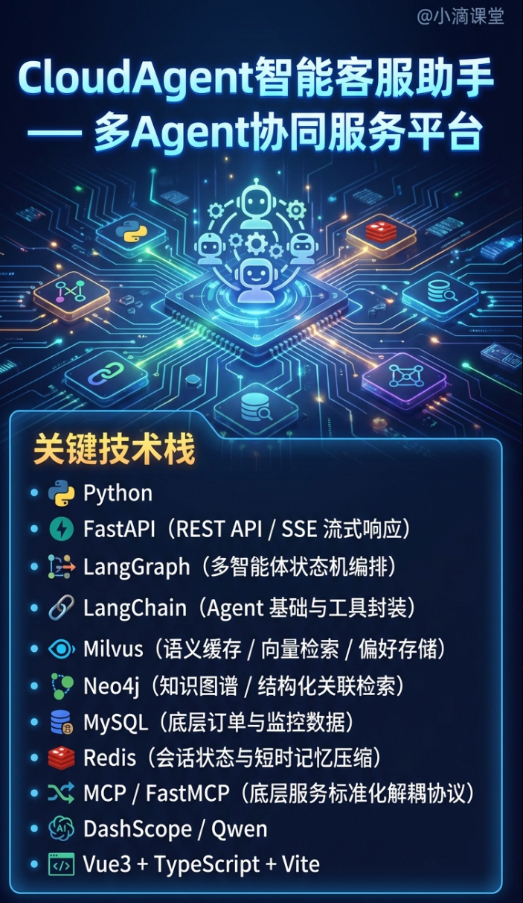

# CloudAgent智能客服助手 — 多Agent协同服务平台

### 关键技术栈

- Python

- FastAPI（REST API / SSE 流式响应）

- LangGraph（多智能体状态机编排）

- LangChain（Agent 基础与工具封装）

- Milvus（语义缓存 / 向量检索 / 偏好存储）

- Neo4j（知识图谱 / 结构化关联检索）

- MySQL（底层订单与监控数据）

- Redis（会话状态与短时记忆压缩）

- MCP / FastMCP（底层服务标准化解耦协议）

- DashScope / Qwen

- Vue3 + TypeScript + Vite

### 项目亮点

- 基于 LangGraph + AgentState 构建状态机路由多Agent协同编排，覆盖Orchestrator、Product、Billing、Recommend、FinOps 多个Agent

- 在 FastAPI 网关层前置 Milvus 向量查询，构建 L1/L2 双层语义缓存，拦截高频标准问题，首字响应缩至 80ms，节省token

- 构建 Milvus (长文本) + Neo4j (图谱) 的混合检索（Hybrid RAG），并行召回模糊概念与精确规格数据，减少复杂云架构选型场景下的参数“幻觉”。

- 采用 FastMCP 协议重构底层服务调用，将查库、调外网 API 等异构能力标准化为独立 Server，封装为MCP工具进行调用

- 设计具拦截器，在 LangGraph 节点流转底层绑定当前登录用户 ID，防止Prompt 注入导致的越权查库攻击。

- 实现 Redis 滑动窗口 (短期) + Milvus 向量化提取 (长期) 的分层记忆体系，会话前自动融合记忆注入 Orchestrator 路由，支持长周期复杂对话中的跨会话认知与个性化应答。

- 后端使用 FastAPI + SSE 输出流式图状态，前端基于 Vue3 实时渲染多 Agent 协同的中间阶段与思考过程，全面提升复杂决策链的可观测性与调试效率。
