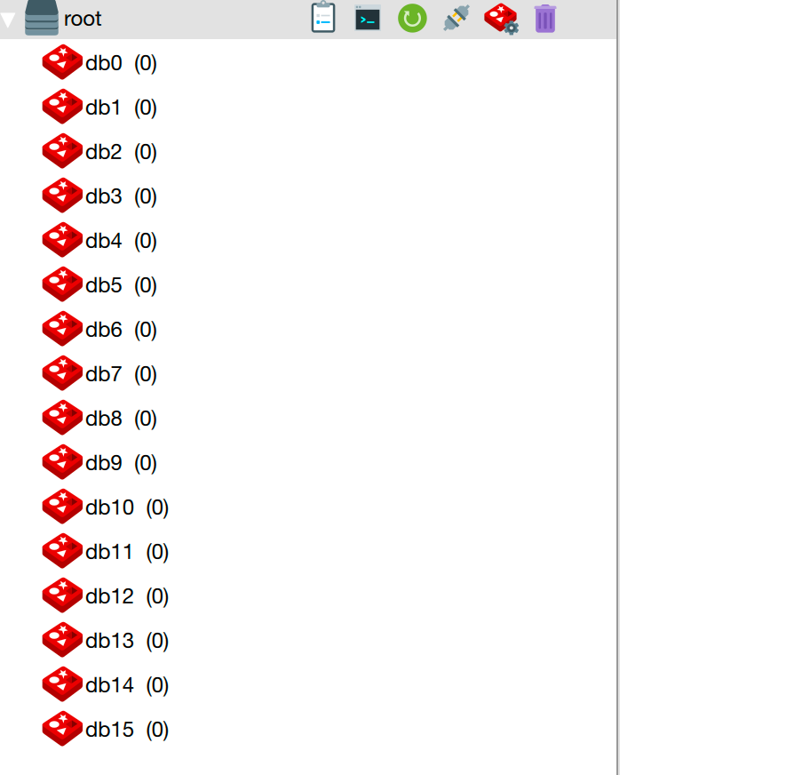
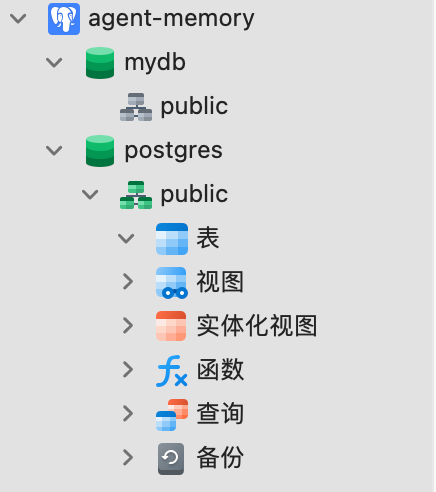

# 环境搭建

## Docker镜像源配置

```text
sudo tee /etc/docker/daemon.json <<-'EOF'
{
    "registry-mirrors": [
        "https://docker.m.daocloud.io",
        "https://noohub.ru",
        "https://huecker.io",
        "https://dockerhub.timeweb.cloud",
        "https://registry.docker-cn.com",
        "https://8xpk5wnt.mirror.aliyuncs.com",
        "https://hub-mirror.c.163.com",
        "https://docker.mirrors.ustc.edu.cn",
        "https://mirrors.tuna.tsinghua.edu.cn",
        "http://mirrors.sohu.com",
        "https://ustc-edu-cn.mirror.aliyuncs.com",
        "https://ccr.ccs.tencentyun.com",
        "https://docker.awsl9527.cn",
        "https://docker.xuanyuan.me"
    ]
}
EOF
```

- 如果是window环境的话，下载个docker客户端软件后操作

## 部署Redis

```text
docker run -d --name redis \
-p 6379:6379 \
-e REDIS_USERNAME=root \
-e REDIS_PASSWORD=Yoxxxxxx \
bitnami/redis:latest
```



## 部署postgres

```text
docker run -d --name postgres \
-p 5432:5432 \
-e POSTGRES_USER=root \
-e POSTGRES_PASSWORD=Yxxxxxx \
-e POSTGRES_DB=mydb \
-v postgres-data:/var/lib/postgresql/data \
postgres:16
```



## 部署Milvus

```text
version: '3.8'
services:
etcd:
container_name: milvus-etcd
image: quay.io/coreos/etcd:v3.5.18
restart: unless-stopped
environment:
- ETCD_AUTO_COMPACTION_MODE=revision
- ETCD_AUTO_COMPACTION_RETENTION=1000
- ETCD_QUOTA_BACKEND_BYTES=4294967296
- ETCD_SNAPSHOT_COUNT=50000
volumes:
- ./etcd/data:/etcd
command: etcd -advertise-client-urls=http://etcd:2379 -listen-client-urls http://0.0.0.0:2379 --data-dir /etcd
networks:
- milvus-network
healthcheck:
test: ["CMD", "etcdctl", "endpoint", "health"]
interval: 30s
timeout: 20s
retries: 3
minio:
container_name: milvus-minio
image: minio/minio:RELEASE.2023-03-20T20-16-18Z
restart: unless-stopped
environment:
MINIO_ROOT_USER: minioadmin
MINIO_ROOT_PASSWORD: minioadmin
ports:
- "9000:9000" # API 端口
- "9001:9001" # 控制台端口
volumes:
- ./minio/data:/minio_data
command: minio server /minio_data --console-address ":9001"
networks:
- milvus-network
healthcheck:
test: ["CMD", "curl", "-f", "http://localhost:9000/minio/health/live"]
interval: 30s
timeout: 20s
retries: 3
milvus-standalone:
container_name: milvus-standalone
image: milvusdb/milvus:v2.5.7
restart: unless-stopped
command: ["milvus", "run", "standalone"]
security_opt:
- seccomp:unconfined
environment:
ETCD_ENDPOINTS: etcd:2379
MINIO_ADDRESS: minio:9000
MINIO_ACCESS_KEY_ID: minioadmin
MINIO_SECRET_ACCESS_KEY: minioadmin
volumes:
- ./milvus/data:/var/lib/milvus/data
- ./milvus/logs:/var/lib/milvus/logs
ports:
- "19530:19530" # gRPC 端口
- "9091:9091" # HTTP 健康检查端口
depends_on:
etcd:
condition: service_healthy
minio:
condition: service_healthy
networks:
- milvus-network
healthcheck:
test: ["CMD", "curl", "-f", "http://localhost:9091/healthz"]
interval: 30s
start_period: 90s
timeout: 20s
retries: 3
attu:
container_name: attu
image: zilliz/attu:v2.5.7
restart: unless-stopped
environment:
MILVUS_URL: milvus-standalone:19530
ports:
- "8000:3000" # Web 访问端口
depends_on:
milvus-standalone:
condition: service_healthy
networks:
- milvus-network
networks:
milvus-network:
driver: bridge
name: milvus-network
```

🚀 启动方式

- 创建部署目录

- mkdir -p ~/milvus-deploycd ~/milvus-deploy

- 保存 docker-compose.yml 文件到当前目录。

- 创建数据目录（确保有写入权限）

- mkdir -p etcd/data minio/data milvus/data milvus/logs

- 启动所有服务

- docker compose up -d


## 重启docker后启动服务

docker start redis postgres

```text
要重启你之前用 Docker Compose 部署的 Milvus 及相关服务（etcd、minio、milvus-standalone、attu），请按以下步骤操作：
1️⃣ 进入部署目录
如果你当时是在某个目录下执行的 docker compose up -d，请先进入该目录：
cd ~/milvus-deploy # 替换为实际目录
2️⃣ 查看当前状态
docker compose ps
如果服务状态显示 exited，说明已经停止。
3️⃣ 启动或重启所有服务
docker compose restart
```

## 部署Neo4j

```text
docker run -d \ --name neo4j \ --restart always \ -p 7474:7474 \ -p 7687:7687 \ -e NEO4J_AUTH=neo4j/12345678 \ -e NEO4J_PLUGINS='["apoc"]' \ -v $HOME/neo4j/data:/data \ -v $HOME/neo4j/logs:/logs \ neo4j:5.18.0
```

## 部署MySQL

```text
docker run -d \
--name mysql8 \
-p 3306:3306 \
-e MYSQL_ROOT_PASSWORD=RootPass123! \
-e MYSQL_DATABASE=mydb \
-e MYSQL_USER=root \
-e MYSQL_PASSWORD=UserPass123! \
-v mysql_data:/var/lib/mysql \
--restart unless-stopped \
mysql:8.0
```

## 1. 环境准备与配置

### 1.1 配置 Python 虚拟环境

项目依赖 Python 3.10 及以上版本。

```bash
# 1. 创建并激活 conda 环境
conda create -n multi_agent python=3.10 -y
conda activate multi_agent

# 2. 安装项目依赖
pip install -r requirements.txt
```

### 1.2 配置环境变量

在项目后端的 agent 目录下（agent/.env）配置所需的大模型 API Key 及数据库连接串。

新建或修改 agent/.env 文件，填入真实的凭证：

```text
# LLM 密钥配置
DASHSCOPE_API_KEY=sk-xxxxxxxxxxxxxxxxxxxxxxxx
BOCHA_API_KEY=sk-xxxxxxxxxxxxxxxxxxxxxxxx

# Redis 配置 (用于短期记忆)
REDIS_URL=redis://:password@your-redis-host:6379

# PostgreSQL/MySQL 业务库配置 (用于 MCP 工具查询)
MYSQL_HOST=your-mysql-host
MYSQL_PORT=3306
MYSQL_USER=your_user
MYSQL_PASSWORD=your_password
MYSQL_DATABASE=mydb

# Milvus 配置 (用于语义缓存与向量 RAG)
MILVUS_HOST=your-milvus-host
MILVUS_PORT=19530
MILVUS_COLLECTION=mult_agent_memory2

# Neo4j 知识图谱配置 (用于架构规格精确查询)
NEO4J_URI=bolt://your-neo4j-host:7687
NEO4J_USER=neo4j
NEO4J_PASSWORD=your_password
```

### 2. 初始化知识库数据

在启动服务前，需要先将云产品的白皮书数据（Markdown/JSON）导入到 Milvus 向量库和 Neo4j 知识图谱中。

```bash
# 进入 agent 测试/构建目录
cd agent/test

# 1. 导入 Milvus 向量知识库 (执行 Chunking 与 Embedding)
python milvus_rag.py

# 2. 导入 Neo4j 规格参数图谱
python build_kg.py
```

(注意：确保 agent/database/init_mock_data.sql 已在你的 MySQL 业务库中成功执行，以初始化测试用的订单和实例数据)

### 3. 启动后端 API 服务

后端采用 FastAPI 提供了流式（SSE）和标准的 REST 接口，同时封装了 LangGraph 的状态机编排。

```bash
# 退回项目根目录，进入 app 网关目录
cd ../../app

# 使用 Uvicorn 启动后端服务 (默认运行在 8000 端口)
uvicorn app_main:app --host 0.0.0.0 --port 5000 --reload
```

启动成功后，可在浏览器访问 http://localhost:5000/docs 查看

### 4. 启动前端工作台

前端是一个基于 Vue3 + Vite + TypeScript 的交互式工作台，支持实时渲染 Agent 思考过程与流式对话。

```bash
# 新开一个终端窗口，进入前端目录
cd front/cloud_agent

# 1. 安装前端依赖
npm install

# 2. 启动本地开发服务器
npm run dev
```

启动成功后，根据终端提示（通常是 http://localhost:5173），在浏览器中打开即可体验智能客服系统。
