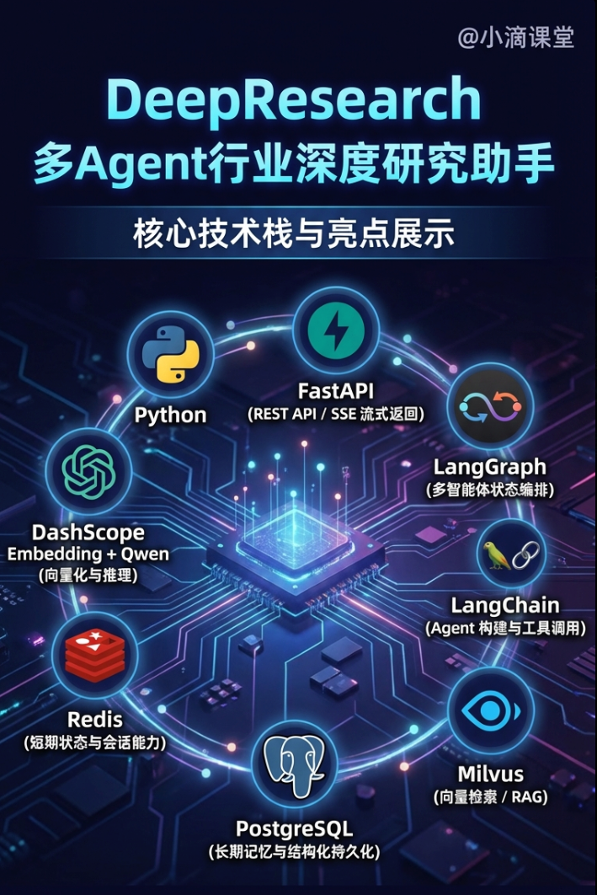
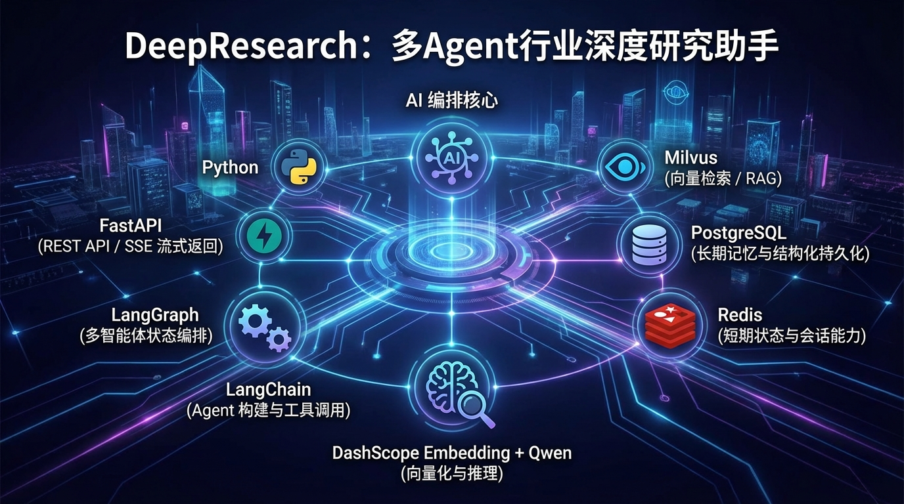
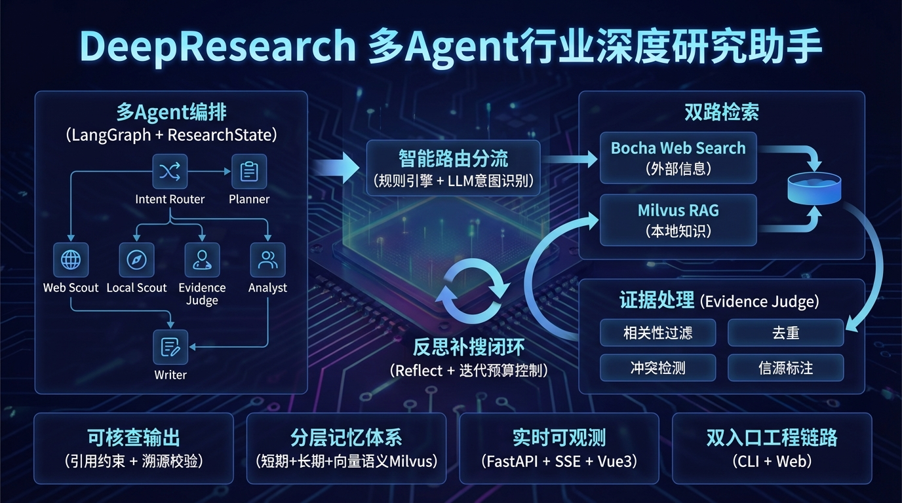
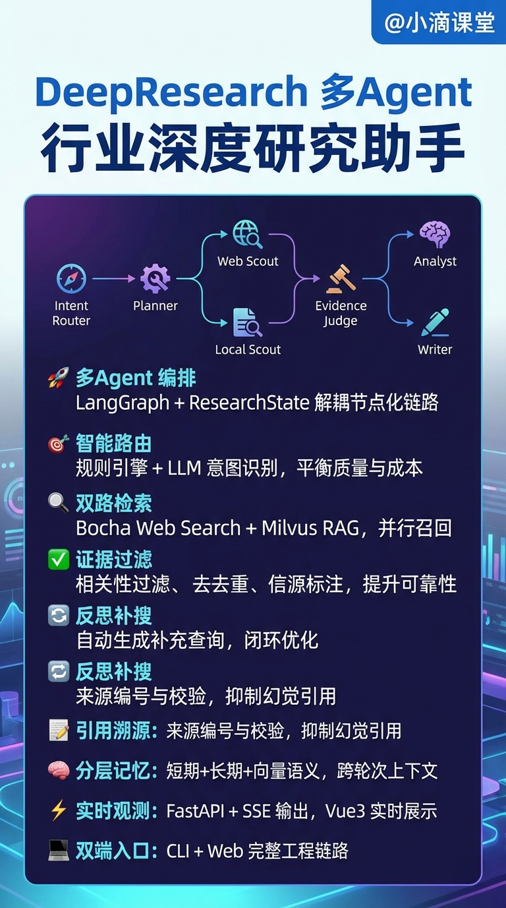

# DeepResearch多Agent行业深度研究助手

### 关键技术栈

- Python

- FastAPI（REST API / SSE 流式返回）

- LangGraph（多智能体状态编排）

- LangChain（Agent 构建与工具调用）

- Milvus（向量检索 / RAG）

- PostgreSQL（长期记忆与结构化持久化）

- Redis（短期状态与会话能力）

- DashScope Embedding + Qwen（向量化与推理）

- Vue3 + TypeScript + Vite（前端工作台）

### 项目亮点

- 基于 LangGraph + ResearchState 实现多 Agent 编排，将 Intent Router、Planner、Web Scout、Local Scout、Evidence Judge、Analyst、Writer 解耦，形成可维护的节点化执行链路。

- 构建 Bocha Web Search + Milvus RAG 的双路检索，并行召回外部信息与本地知识，提升证据覆盖率，降低单源信息偏差。

- 通过 规则引擎 + LLM 意图识别 做路由分流，在保证质量的同时控制时延与 Token 成本。

- 在证据处理环节引入 Evidence Judge（相关性过滤、去重、冲突检测、信源标注），把“可检索”提升为“可用证据”，增强结果可靠性。

- 设计 Reflect 反思补搜机制 + 迭代预算控制，当证据不足时自动生成补充查询并二次检索，实现“检索-分析-补搜”的闭环优化。

- 输出阶段强调 引用约束与溯源校验，通过来源编号与校验策略抑制幻觉引用，提升报告可核查性与可追溯性。

- 实现 短期记忆（会话）+ 长期记忆（用户）+ 向量语义记忆（Milvus） 的分层记忆体系，支持跨轮次上下文注入与个性化应答。

- 后端使用 FastAPI + SSE 输出节点级阶段事件，前端基于 Vue3 实时展示执行过程，提升可观测性与调试效率。

- 支持 CLI + Web 双入口，形成从算法编排、服务接口到可视化交互的完整工程链路，便于演示和持续迭代。

