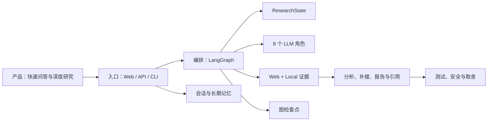

# DeepResearch 学习导航

## 文档状态

- 适用源码：`code/deep_research` 当前工作区，最近可见提交 `e763b98a...`
- 目标读者：零基础到具备基础编程经验的学习者
- 建议总学习时间：8 至 12 小时静态学习，运行实验另计
- 当前授权：L3，可选择性阅读源码；尚未获得 L4 运行授权
- 事实边界：架构和调用关系已静态验证 `[V]`，安装、启动、测试和真实外部调用仍为 `[U]`

## 学完后应该能做到

1. 不看文档画出 Web、FastAPI、LangGraph、模型、检索和记忆的系统上下文。
2. 从一次页面提交追到 `final` SSE 事件，并说明 direct 与 multiagent 的分叉条件。
3. 解释证据 ID 如何产生、如何进入证据池，以及 Writer 如何限制非法引用。
4. 区分 LangGraph checkpointer、短期记忆、长期记忆和本地知识库 RAG。
5. 说明当前实现的优点、失败降级、测试缺口和多租户风险，不使用无证据指标。

## 最小前置知识

| 主题 | 需要程度 | 不熟悉时先掌握什么 |
|---|---|---|
| Python | 了解 | 函数、类、字典、类型标注、异常、线程 |
| HTTP/FastAPI | 了解 | POST、JSON、状态码、依赖注入、流式响应 |
| Vue/TypeScript | 可选 | `ref`、组件事件、`fetch`、ReadableStream |
| LLM/Prompt | 了解 | system/user 消息、结构化 JSON 输出、幻觉 |
| LangGraph | 首次可学 | 状态、节点、边、条件路由、checkpointer |
| RAG | 首次可学 | Embedding、向量检索、召回片段、引用来源 |

## 知识地图

## 推荐阅读顺序

| 顺序 | 文档 | 目标 | 预计时间 | 完成判定 |
|---|---|---|---|---|
| 1 | `01-project-and-product.md` | 建立产品边界 | 15 分钟 | 能用一句话说明项目，不夸大“企业级” |
| 2 | `02-product-journeys.md` | 认识两条用户链路 | 20 分钟 | 能解释 direct 与 multiagent |
| 3 | `05-architecture.md` | 建立系统全景 | 25 分钟 | 能画出进程与外部依赖 |
| 4 | `06-codebase-map.md` | 找到入口和模块 | 20 分钟 | 能从用户动作定位到五个关键文件 |
| 5 | `07-domain-and-data.md` | 理解状态与证据 | 35 分钟 | 能区分四类状态/存储 |
| 6 | `08-core-flow-main.md` | 追踪端到端主链路 | 60 分钟 | 能按顺序复述节点输入输出与失败路径 |
| 7 | `09-key-code-deep-dives.md` | 精读高价值符号 | 90 分钟 | 能解释至少四个符号的修改影响 |
| 8 | `03`、`04`、`10` | 理解环境、依赖和集成 | 60 分钟 | 能列出最小依赖与可选依赖 |
| 9 | `11`、`12` | 建立质量判断 | 45 分钟 | 能给出有证据的风险优先级 |
| 10 | `13`、`14` | 练习与面试复述 | 60 分钟 | 完成 Level 1/2 并录一次五分钟讲解 |

## 零基础路径

先只读 `01`、`02` 和 `05`，不要立即进入 1,380 行的 `nodes.py`。第二轮对照 `graph.py::build_app` 和 `state.py::ResearchState`；第三轮沿 `08-core-flow-main.md` 只阅读公开节点函数。记忆模块放到最后，因为它比主研究链路更长、后端分支更多。

## 时间紧张路径

用 90 分钟阅读 `01` → `05` → `08` → `12` → `14`。简洁版尚未生成；在详细版通过 G6 前，不应把旧面试稿当作事实源。

## 学习时必须区分的四组概念

| 容易混淆 | 正确区分 |
|---|---|
| 多 Agent 与自主工具调用 | 这里是固定图上的多角色 LLM；实际 Agent 的 `tools=[]` |
| SSE 与 token 流 | SSE 发送节点阶段及最终整段报告，不逐 token 发送正文 |
| RAG 与记忆 | RAG 搜本地知识库；记忆保存用户/会话上下文 |
| Checkpointer 与业务数据库 | Checkpointer 保存图状态；MemoryManager 保存对话、画像和任务 |

## 当前验证矩阵

| 范围 | 状态 | 证据 | 尚缺什么 |
|---|---|---|---|
| 产品入口与调用链 | `[V]` | E-FLOW-001、E-FLOW-002、E-FLOW-003、E-FLOW-004 | 浏览器和 API 实测 |
| 图节点、状态与检索 | `[V]` | E-FLOW-004、E-FLOW-005、E-FLOW-006、E-FLOW-007、E-FLOW-008、E-DATA-001 | 真实 trace 与结果质量 |
| 记忆与降级 | `[V]` | E-DATA-002、E-DATA-003 | 各后端组合实测 |
| 安装、启动、构建、测试 | `[U]` | E-BOOT-* | L4 授权与隔离环境 |
| 性能与质量指标 | `[U]` | E-OPEN-007 | 数据集、指标定义和复现实验 |

## 下一步

完成静态文档后先做证据与矛盾检查。只有用户授予 L4，才进入依赖安装、构建、服务启动、测试和浏览器验证；运行结果会回填本套详细版，再进行 G6 验收。
