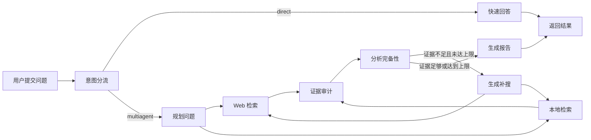

# DeepResearch 产品链路

## 阅读说明

- 前置知识：`01-project-and-product.md`
- 阅读目标：从用户操作理解快速回答与深度研究两条链路
- 预计时间：20 分钟

## 产品链路总览

图由当前 LangGraph 节点和边直接映射而来。[V][E-FLOW-004]

## 场景 A：快速回答

1. 用户在 Web 或 API 提交问题，同时提交 tenant/user/thread ID。[V][E-FLOW-001][E-FLOW-002]
2. `detect_intent` 用关键词规则初判，Intent Router LLM 输出 direct/multiagent JSON。[V][E-FLOW-005]
3. direct 路径调用 Direct Responder，并把可用记忆上下文拼入提示词。[V][E-FLOW-005][E-DATA-002]
4. 最终文本通过同步 JSON 或 SSE `final` 事件返回。[V][E-FLOW-002][E-FLOW-003]
5. 若记忆启用，问答对会在返回前持久化。[V][E-DATA-002]

快速回答依然调用一次意图 LLM 和一次回答 LLM，并非完全基于规则的低成本路径。

## 场景 B：深度研究

| 阶段 | 用户可见行为 | 系统行为 | 主要代码 | 证据 |
|---|---|---|---|---|
| 接收 | 页面显示初始化 | FastAPI 校验请求并启动工作线程 | `research_router.py`、`workflow_service.py` | E-FLOW-002、003 |
| 分流 | 显示 Intent Router | 规则 + LLM 决定 multiagent | `nodes.py::intent_node` | E-FLOW-005 |
| 规划 | 显示 Planner | 生成子问题、大纲、预算和最多 6 个搜索词 | `nodes.py::plan_node` | E-FLOW-005 |
| 检索 | Web/Local 阶段进度 | Bocha 与 Milvus 分支从同一计划获取证据 | `nodes.py::web_search_node/local_rag_node` | E-FLOW-006、008 |
| 审计 | 显示 Evidence Judge | 约束 source ID、评分、去重、生成来源索引 | `nodes.py::deep_dive_node` | E-FLOW-006 |
| 分析 | 显示 Analyst | 形成 findings/claim_map 并判断缺口 | `nodes.py::analyze_node` | E-FLOW-007 |
| 补搜 | 显示 Reflect | 生成新查询，迭代计数加 1，回到双路检索 | `nodes.py::reflect_node` | E-FLOW-007 |
| 写作 | 显示 Writer | 生成 Markdown，移除非法引用，追加参考资料 | `nodes.py::write_node` | E-FLOW-007 |
| 完成 | 页面展示报告 | SSE 发送 route 和 final 事件 | `workflow_service.py::stream_events` | E-FLOW-003 |

## 用户实际看到的进度

前端不会收到模型的 token 级正文流，而是收到“节点完成更新”。最终报告在 Writer 完成后一次性放入 `final` 事件。[V][E-FLOW-001][E-FLOW-003]

因此旧文档中的“流式返回”应解释为阶段事件流，而不是逐 token 生成流。

## 失败与降级路径

| 故障 | 代码行为 | 用户结果 | 仍需运行确认 |
|---|---|---|---|
| 未配置 Bocha Key | Web 搜索返回空列表 | 可能只用本地证据继续 | 是否能生成有意义报告 |
| Milvus 初始化失败 | 全局 RAG 保持不可用 | 本地检索返回空列表 | 启动时日志和最终报告质量 |
| PostgreSQL/Redis checkpointer 失败 | 降级到内存 saver | 当前进程仍可运行 | 重启后状态丢失和并发行为 |
| MemoryManager 初始化失败 | 禁用外部记忆 | 主研究图仍尝试运行 | 哪类配置错误会触发 |
| 任一工作线程异常 | SSE 发送 error 事件 | 前端显示请求失败 | 错误文本是否泄露内部细节 |
| Writer 未产生 final | 服务再次 `invoke` 整张图 | 可能重复外部调用 | 是否存在可触发场景 |

## 产品层面的关键限制

- 用户可自行填写身份键，系统没有登录或授权验证。[V][E-RISK-001]
- 页面最多保留 6 条进度日志，完整节点 trace 只存在服务端状态/日志中。
- 没有取消研究任务、历史任务列表、报告持久化或重试按钮。
- 报告最少 2000-3000 字是提示词要求，不是质量保证。

