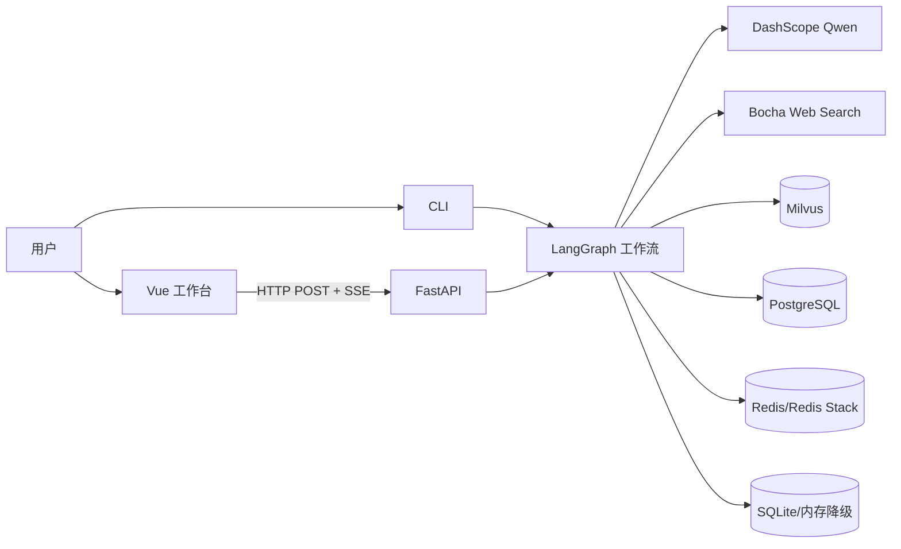
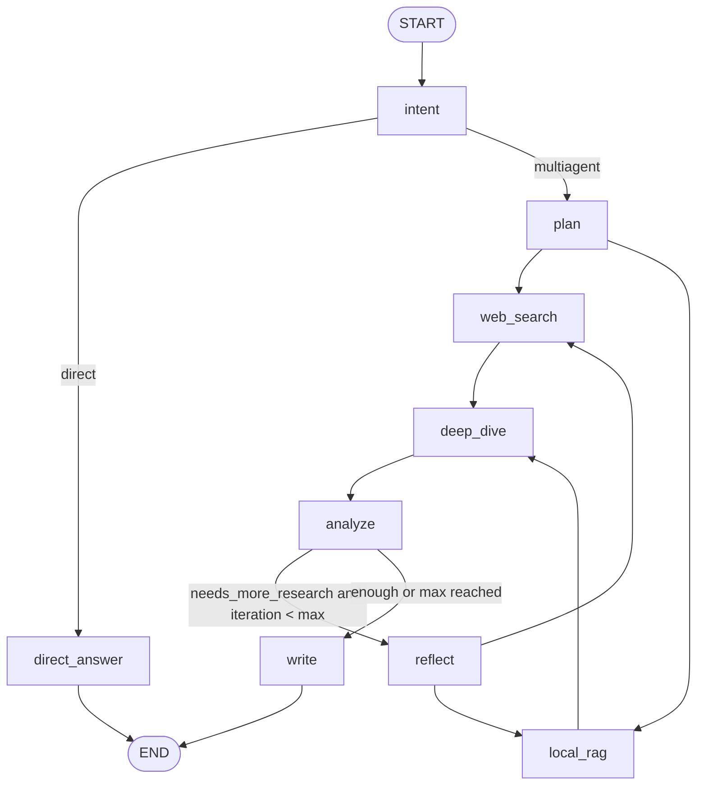

# DeepResearch 架构

## 架构结论

项目是单仓库、双入口的模块化单体：Vue 前端与 FastAPI 后端通过 HTTP/SSE 协作，CLI 和 Web 后端共享同一 LangGraph、Agent 构建、检索与记忆模块。数据库和外部 API 是可降级适配器，但部分降级会削弱持久化和租户隔离。[V][E-ARCH-006][E-ARCH-007][E-FLOW-003]

## 系统上下文

## 逻辑分层

| 层 | 模块 | 职责 | 证据 |
|---|---|---|---|
| 交互层 | `front/agent_front/src/App.vue`、根 `main.py` | Web 与 CLI 用户入口 | E-FLOW-001、E-ARCH-007 |
| API 层 | `app_main.py`、`backend/router`、`schemas` | CORS、参数校验、同步/SSE 接口 | E-ARCH-006、E-FLOW-002 |
| 应用服务层 | `backend/service/workflow_service.py` | 初始化资源、构造请求状态、桥接同步图和异步 SSE | E-FLOW-003 |
| 编排层 | `mult_agents/graph.py`、`state.py` | 图节点、分支、循环和共享状态 | E-FLOW-004、E-DATA-001 |
| 节点层 | `mult_agents/nodes.py`、`prompts.py` | 规则、LLM 结构化处理、证据约束和报告输出 | E-FLOW-005、006、007 |
| 工具/检索层 | `tools.py`、`rag/core.py` | Bocha HTTP 调用和 Milvus 相似度检索 | E-FLOW-008、E-ARCH-001 |
| 记忆层 | `memory/*`、checkpointer | 会话、画像、长期事实、任务和图检查点 | E-DATA-002、003 |

## 运行时初始化

Web 模式中 `WorkflowService` 是进程级缓存单例，第一次研究请求才读取 `config.json`、创建 MemoryManager、八个 Agent、checkpointer 和编译图。[V][E-FLOW-003]

CLI 模式在进程启动时完成同样的构建，然后进入单次或循环输入。[V][E-ARCH-007]

这意味着 `/health` 可以在研究依赖尚未可用时返回 `ok`；当前健康检查只证明 FastAPI 进程存在，不证明模型、Bocha、Milvus、PostgreSQL 或 Redis 可用。

## LangGraph 结构

Reflect 复用 Planner Agent，不存在独立 Reflect Agent 对象。[V][E-ARCH-009]

## Agent 与工具的真实关系

八个 Agent 都通过 `create_agent` 创建，但 tools 参数为空。节点函数先直接调用 Bocha/Milvus，再把原始记录交给对应 Agent 做 JSON 整理或判断。[V][E-ARCH-009][E-FLOW-006]

因此它更准确地属于“图驱动的多角色 LLM pipeline”，不是每个 Agent 自主选择工具的 ReAct 系统。

## 数据与状态边界

- `ResearchState` 是单次图执行的共享总线。[V][E-DATA-001]
- checkpointer 保存图状态，但调用命名空间只有 thread ID。[V][E-DATA-003][E-RISK-002]
- MemoryManager 管理对话和跨会话记忆，并尝试按 tenant/user/thread 过滤。[V][E-DATA-002]
- PostgreSQL/Redis 失败后可以退到内存或 SQLite，但隔离语义会变化。[V][E-RISK-003]

## 架构优点

- 产品阶段与节点边界一一对应，便于观察和替换。
- 证据 ID 在检索后立即固定，后续 LLM 只能从真实 ID 中选择。
- 同一工作流服务 CLI、同步 API 和 SSE API。
- 多个外部存储具备降级路径，演示环境更容易存活。

## 架构代价

- 状态字段多且缺少运行时 schema 校验，节点间契约主要靠约定。
- 1,380 行 `nodes.py` 和 1,492 行 `MemoryManager` 集中太多职责。
- 同名节点残留在 `mult_agents/main.py`，增加阅读和维护歧义。[V][E-ARCH-008]
- 单例服务和全局 RAG/checkpointer 上下文使多配置、多租户和测试隔离更困难。
- 降级策略偏向“继续运行”，但可能悄悄失去检索、持久化或隔离能力。

