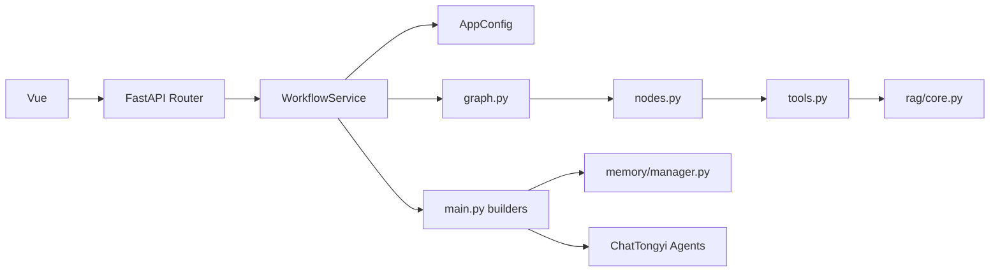

# DeepResearch 代码库地图

## 阅读目标

第一次阅读不要从最长的 `nodes.py` 或 `MemoryManager` 开始。先确定入口和图，再沿一条链路进入节点、检索和记忆。

## 顶层结构

```text
code/deep_research/
├── main.py                         # CLI 启动包装
├── app/app_main.py                 # FastAPI 入口
├── app/backend/                    # HTTP 配置、路由、schema、应用服务
├── app/mult_agents/
│   ├── graph.py                    # 当前图结构和条件边
│   ├── state.py                    # 共享状态契约
│   ├── nodes.py                    # 当前节点实现
│   ├── main.py                     # 资源构建、CLI；含遗留重复节点
│   ├── prompts.py                  # Agent system prompts
│   ├── tools.py                    # Bocha 与本地 RAG 适配
│   ├── rag/                        # Milvus 检索与入库
│   └── memory/                     # 短期、长期、语义、任务记忆
├── app/test/                       # 当前只有 Bocha 手工外部调用脚本
├── front/agent_front/              # Vue 3 + Vite 工作台
├── config.json                     # 默认运行配置
├── .env.example                    # 环境变量模板，当前漏 BOCHA_API_KEY
├── pyproject.toml                  # 核心依赖声明
└── requirements.txt                # 精确但可能混入遗留项的依赖快照
```

## 关键入口

| 顺序 | 路径与符号 | 作用 | 为什么先读 |
|---|---|---|---|
| 1 | `front/.../App.vue::runResearch` | 用户请求与 SSE 消费 | 先看到真实产品动作 |
| 2 | `backend/router/research_router.py` | API 边界 | 明确请求/响应协议 |
| 3 | `backend/service/workflow_service.py` | Web 到图的桥梁 | 理解初始化、状态和事件 |
| 4 | `mult_agents/graph.py::build_app` | 工作流拓扑 | 建立全局地图 |
| 5 | `mult_agents/state.py::ResearchState` | 节点共享数据 | 理解每一步读写什么 |
| 6 | `mult_agents/nodes.py` 的公开节点 | 核心业务逻辑 | 按图顺序逐个读 |
| 7 | `tools.py`、`rag/core.py` | 外部证据来源 | 理解证据怎么产生 |
| 8 | `memory/manager.py` | 跨轮次上下文 | 最后读复杂持久化和降级 |

## 模块依赖方向



## 需要警惕的重复和遗留

- `mult_agents/main.py` 113-271 仍定义 plan/web/local/deep_dive/analyze/codegen/write 等节点，但 `graph.py` 从 `nodes.py` 导入当前节点。[V][E-ARCH-008]
- `rag_core.py` 只有旧导入兼容痕迹，当前实现使用 `rag/core.py`。
- `rag/ingest.py` 有旧包导入和绝对路径，不能作为现成运行命令。[V][E-RISK-004]
- Vue 模板自带的 `HelloWorld/TheWelcome/WelcomeItem/icons` 没有进入当前 App 主链路，可后读或忽略。
- Neo4j、MySQL、Flask、MCP、WebSocket 只出现在依赖或旧文档中，不在当前源码调用链。[V][E-ARCH-010]

## 建议精读符号

P0：`WorkflowService._run_sync_with_events`、`build_app`、`intent_node`、`plan_node`、`web_search_node`、`local_rag_node`、`deep_dive_node`、`analyze_node`、`reflect_node`、`write_node`。

P1：`build_checkpointer`、`build_memory_manager`、`build_personalized_prompt_context`、`persist_turn`、`bocha_web_search_records`、`RAGSystem.search_records`。

P2：提示词、报告附录渲染、记忆统计和 CLI 辅助命令。

