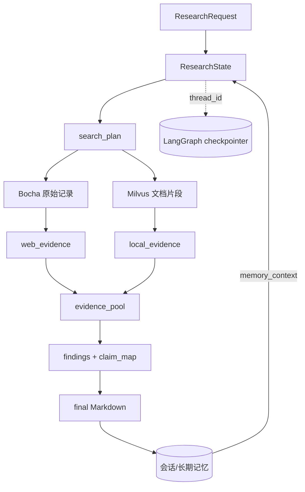
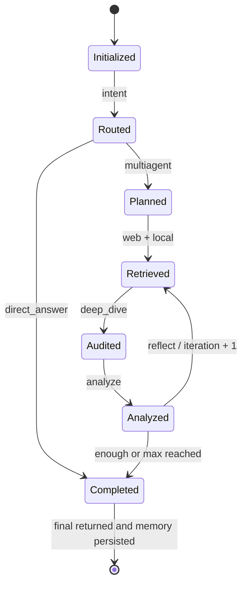
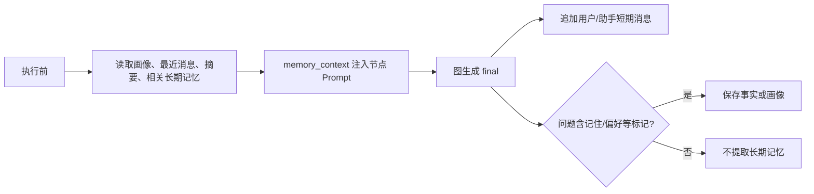

# DeepResearch 核心概念、数据与状态

## 阅读目标

理解一次研究任务在图内如何变化，以及图状态、检查点、记忆和知识库为什么不是同一类数据。

## 核心概念

| 概念 | 通俗解释 | 代码表示 | 生命周期 | 证据 |
|---|---|---|---|---|
| 研究任务 | 用户的一次问题及其最终报告 | `ResearchRequest`、`ResearchState` | 请求进入到 `final` 返回 | `[V]` E-FLOW-002、E-DATA-001 |
| 意图 | 选择快速回答或深度研究 | `ResearchState.intent` | Intent 节点写入，路由读取 | `[V]` E-FLOW-004、E-FLOW-005 |
| 搜索计划 | 最多六个受原问题约束的查询 | `search_plan`、`supplementary_queries` | Plan 创建，Reflect 可替换补搜计划 | `[V]` E-FLOW-005、E-FLOW-007 |
| 原始记录 | Bocha/Milvus 返回的搜索结果 | 节点局部 `raw_records` | 单个检索节点内产生和清洗 | `[V]` E-FLOW-006、E-FLOW-008 |
| 证据 | 带受控 `source_id` 的可引用记录 | `web_evidence`、`local_evidence` | 检索产生，后续轮次累积 | `[V]` E-FLOW-006 |
| 证据池 | Web/Local 合并、评分和审计后的集合 | `evidence_pool`、`audit_flags` | Deep Dive 写入，Analyze/Writer 消费 | `[V]` E-FLOW-006、E-FLOW-007 |
| Finding | 结论与来源 ID 的映射 | `findings`、`claim_map` | Analyze 创建，Writer 消费 | `[V]` E-FLOW-007 |
| 图检查点 | LangGraph 执行状态快照 | `PostgresSaver` / `RedisSaver` / `InMemorySaver` | 以 `thread_id` 配置执行 | `[V]` E-DATA-003 |
| 短期记忆 | 最近对话和滚动摘要 | Redis/PostgreSQL/内存 | 执行前读取，执行后追加 | `[V]` E-DATA-002 |
| 长期记忆 | 用户画像、事实和可选任务记录 | PostgreSQL/SQLite/Milvus | 按标记提取并跨会话检索 | `[V]` E-DATA-002 |
| 本地知识库 | 供研究检索的文档片段 | `RAGSystem` + Milvus collection | 需预先入库，研究时只检索 | `[V]` E-ARCH-001、E-FLOW-006 |

## 一次请求的数据关系

## ResearchState 分组

| 分组 | 主要字段 | 谁写入 | 谁消费 |
|---|---|---|---|
| 请求上下文 | `query/user_id/tenant_id/memory_context` | `create_initial_state` | 所有节点 |
| 路由与阶段 | `intent/phase/iteration/max_iterations` | Intent、Plan、Reflect | 条件边、SSE 服务 |
| 规划 | `outline/sub_questions/research_questions/search_plan/budget` | Plan | 两路检索、附录 |
| 检索 | `web_evidence/local_evidence/*_stats/*_trace` | Web/Local 节点 | Deep Dive、报告附录 |
| 审计 | `evidence_pool/audit/audit_flags/source_index` | Deep Dive | Analyze、Writer |
| 分析与补搜 | `analysis/findings/claim_map/needs_more_research/missing_gaps/supplementary_queries` | Analyze、Reflect | 条件边、检索、Writer |
| 输出 | `draft/final` | Direct 或 Writer | API、CLI、记忆持久化 |
| 消息累积 | `messages`，使用 `operator.add` reducer | 各 LLM 节点 | 后续节点或检查点 |

`ResearchState` 是 `TypedDict`，提供静态提示但不会在运行时自动验证每个节点的返回结构。[V][E-DATA-001]

## 主状态生命周期

重要不变量：

- 路由值最终只能是 `direct` 或 `multiagent`；非法 LLM 输出回退到规则结果。[V][E-FLOW-005]
- 搜索查询最多六条，检索每条最多取四个结果。[V][E-FLOW-005][E-FLOW-006]
- LLM 整理出的证据只能保留原始记录中已分配的 source ID。[V][E-FLOW-006]
- Writer 中不符合合法 source ID 集的引用会被删除。[V][E-FLOW-007]
- 达到 `max_iterations` 后即使仍有缺口也进入 Writer。[V][E-FLOW-004]

## 证据 ID 生命周期

第一轮 Web ID 形如 `WEB1_1-1`，Local ID 形如 `LOC1_1-1`；数字依次表示检索轮次、该轮查询序号和结果序号。补搜后前缀变为 `WEB2`/`LOC2`。ID 先由 Python 分配，再允许 LLM 从中筛选，因此 LLM 不能合法新增一个来源 ID。[V][E-FLOW-006][E-FLOW-007]

但“ID 合法”只证明来源存在于本次检索结果，不证明其内容真实、与结论一致或质量足够；当前无评测集证明引用准确率。[U][E-OPEN-007]

## 记忆数据路径

短期后端优先按配置使用 PostgreSQL 或 Redis，失败时退到进程内 `ShortTermMemory`；长期后端可用 PostgreSQL、SQLite 或 disabled，Milvus 只承担长期记忆的向量索引/检索增强。[V][E-DATA-002]

## 一致性与事务边界

- 图执行、最终结果返回准备和记忆持久化不在同一数据库事务中。
- `persist_turn` 在图完成后执行；Web 服务没有像 CLI 那样包裹单独的记忆异常处理，因此记忆写入失败可能让已生成结果以请求错误结束。[V][E-DATA-002]
- 双路检索共享 LangGraph 状态合并，但外部 Web/RAG 调用没有跨系统事务。
- 检查点只收到 `thread_id`，而请求还包含 tenant/user；同名 thread 可能产生隔离碰撞。[V][E-RISK-002]

## 敏感数据与隔离

| 数据 | 可能包含 | 预期隔离键 | 当前问题 |
|---|---|---|---|
| 请求/报告 | 用户问题、研究结论 | tenant/user/thread | API 不认证，标识由客户端自报 |
| PostgreSQL/Redis 短期记忆 | 完整问答文本与摘要 | tenant + user + thread | 数据结构较完整，但调用方身份不可信 |
| 内存短期记忆 | 问答文本 | 实际只有 thread | 降级后丢失 tenant/user 隔离 |
| PostgreSQL 长期记忆 | 画像、事实、任务 | tenant + user，可含 thread | 需运行验证查询过滤 |
| SQLite 长期记忆 | 画像、事实、任务 | user + namespace | 表中无 tenant 列 |
| Git 跟踪 `memory.db` | 内容未读取 | 不应进仓库 | 可能携带会话或用户数据 `[I]` |

## 未知项

- 各存储后端在当前依赖版本下是否能成功建表、读写和降级，等待 L4/L5。
- 已提交 `memory.db` 的内容和来源未读取，必须先获得针对数据文件的明确授权。
- 检查点是否会在实际并发请求中出现跨用户恢复，需设计隔离测试后验证。
