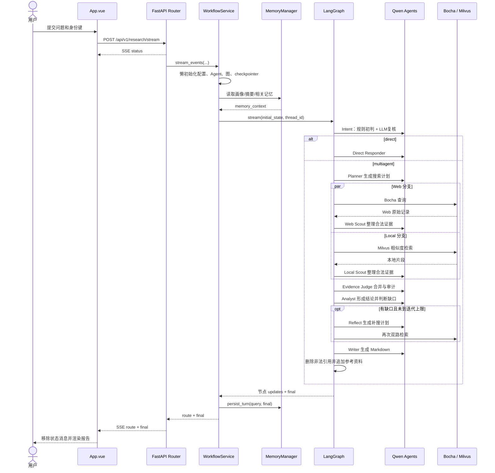

# 核心链路：从 Web 提问到带引用研究报告

## 阅读说明

- 产品价值：把一个复杂问题自动拆解、检索、审计和写成可追溯报告
- 前置知识：`02-product-journeys.md`、`05-architecture.md`、`07-domain-and-data.md`
- 预计时间：60 分钟
- 验证状态：源码调用关系 `[V]`；真实运行结果 `[U]`

## 一句话说明

Vue 将问题 POST 到 FastAPI SSE 接口，`WorkflowService` 把请求转成 `ResearchState` 后执行共享 LangGraph；图根据意图进入双路检索、证据审计、分析与可选补搜，Writer 生成报告并校验引用，最后以单个 `final` 事件返回。[V][E-FLOW-001][E-FLOW-002][E-FLOW-003][E-FLOW-004][E-FLOW-005][E-FLOW-006][E-FLOW-007][E-FLOW-008]

## 触发与结果

| 项目 | 内容 | 证据 |
|---|---|---|
| 参与者 | 能访问 Web 页面的用户；当前无认证角色 | `[V]` E-FLOW-001、E-RISK-001 |
| 触发 | 输入非空问题并点击发送/回车 | `[V]` E-FLOW-001 |
| 输入 | `query/user_id/thread_id/tenant_id`；API 还可接 `max_iterations/enable_memory` | `[V]` E-FLOW-002 |
| 输出 | 阶段事件、route 事件、最终 Markdown 或 error | `[V]` E-FLOW-002、E-FLOW-003 |
| 外部副作用 | LLM/Bocha/Embedding 调用，可能写检查点和记忆 | `[V]` E-FLOW-003、E-FLOW-008、E-DATA-002、E-DATA-003 |

## 端到端顺序图



## 节点追踪

| 序号 | 阶段 | 路径与符号 | 关键处理 | 输出/副作用 | 证据 |
|---|---|---|---|---|---|
| 1 | 前端提交 | `App.vue::runResearch` | 阻止空/重复提交，发 POST，按空行切 SSE 块 | 页面消息与进度 | `[V]` E-FLOW-001 |
| 2 | API 校验 | `ResearchRequest`、`stream_research` | Pydantic 校验非空 ID、迭代 1..6 | `StreamingResponse` | `[V]` E-FLOW-002 |
| 3 | 初始化 | `WorkflowService::_ensure_initialized` | 首次请求读取配置并构建资源 | 单例图、Agent、存储连接 | `[V]` E-FLOW-003 |
| 4 | 个性化上下文 | `build_personalized_prompt_context` | 拼接画像、最近对话、摘要、相关记忆 | `memory_context` | `[V]` E-DATA-002 |
| 5 | 初始状态 | `create_initial_state` | 初始化约 38 个状态字段 | `ResearchState` | `[V]` E-DATA-001 |
| 6 | 意图 | `intent_node` | 规则先判，再要求 LLM 输出 route JSON；非法值回退 | `intent` | `[V]` E-FLOW-005 |
| 7 | 规划 | `plan_node` | JSON 容错、生成最多六条 grounded 查询 | 规划字段、`iteration=0` | `[V]` E-FLOW-005 |
| 8 | Web 检索 | `web_search_node` | 每查询调用 Bocha，分配 ID、去重、LLM 筛选合法 ID | 累积 Web 证据/trace | `[V]` E-FLOW-006、E-FLOW-008 |
| 9 | Local 检索 | `local_rag_node` | Milvus 相似检索，分配 ID、去重、LLM 筛选 | 累积 Local 证据/trace | `[V]` E-FLOW-006 |
| 10 | 审计 | `deep_dive_node` | 合并来源、评分、冲突标记、补齐未入池来源 | evidence pool/source index | `[V]` E-FLOW-006 |
| 11 | 分析 | `analyze_node` | 生成 finding/claim map，判断是否缺证据 | `needs_more_research` | `[V]` E-FLOW-007 |
| 12 | 补搜 | `reflect_node` | 针对缺口生成新计划，迭代 +1 | 返回两路检索 | `[V]` E-FLOW-007 |
| 13 | 写作 | `write_node` | 只给合法 ID，移除非法引用，追加来源列表 | `final` Markdown | `[V]` E-FLOW-007 |
| 14 | 事件桥接 | `_run_sync_with_events` | 后台线程消费图 updates，发节点级 phase | asyncio queue | `[V]` E-FLOW-003 |
| 15 | 完成 | `persist_turn`、SSE final | 追加短期问答，可提取长期偏好/事实 | 页面最终报告 | `[V]` E-DATA-002、E-FLOW-003 |

## 关键分支

### Direct

`detect_intent` 先以关键词判断，但 Intent Router LLM 可以覆盖规则结果。Direct 路径仍至少包含意图模型和回答模型两次调用；不会检索，也不会生成来源列表。[V][E-FLOW-005]

### Multiagent

Planner 后的 Web 与 Local 是 LangGraph 两条分支，不是 Agent 自主决定。两条边汇入 `deep_dive`，任何一侧无结果时另一侧仍可继续；两侧都无证据时 `deep_dive_node` 返回空更新，后续仍会分析和写作，结果质量无法由静态代码保证。[V][E-FLOW-004][E-FLOW-006]

### Reflect 循环

只有 `needs_more_research=true` 且 `iteration < max_iterations` 才进入 Reflect。Reflect 先把 iteration 加一，下一轮检索使用 `supplementary_queries`，证据和 trace 在旧状态上继续累积。[V][E-FLOW-004][E-FLOW-007]

## 失败、重试与降级

| 故障点 | 代码行为 | 用户结果 | 自动重试/降级 | 测试覆盖 |
|---|---|---|---|---|
| 请求字段非法 | FastAPI/Pydantic 拒绝 | 非 2xx，前端显示响应文本 | 无 | 未发现 |
| 缺少 DashScope Key | `AppConfig.from_file` 抛错 | SSE error 或同步 500 | 无 | 未发现 |
| Bocha 缺 Key/超时/HTTP 错误 | 返回空列表 | 继续本地分支 | 不重试，空证据降级 | 仅有真实 API 手工脚本 |
| RAG 初始化/检索失败 | 全局 RAG 不可用或返回空 | 继续 Web 分支 | 空证据降级 | 未发现 |
| LLM JSON 非法 | `_load_json` 使用节点 fallback | 流程继续但内容可能贫化 | fallback，不重试 | 未发现 |
| 存储初始化失败 | checkpointer 退内存，记忆可能退 SQLite/内存 | 功能降级，页面无明确提示 | 有降级 | 未发现 |
| 节点任意异常 | worker 捕获并发 `error` | 前端移除状态并显示失败 | 无节点级重试 | 未发现 |
| stream 未取得 final | 再次 `app.invoke` 初始状态 | 可能重复全部模型/外部调用 | 整图重跑 | 未发现 |
| 记忆持久化失败 | Web 路径异常向上传播 | 已生成报告可能变成 error | Web 无单独降级 | 未发现 |
| 浏览器中断 | 未发现取消信号传给 worker | 后台线程可能继续工作 `[I]` | 无 | 未发现 |

## 建议代码阅读顺序

1. `front/agent_front/src/App.vue::runResearch`：先理解用户看到什么。
2. `backend/router/research_router.py::stream_research`：确认协议边界。
3. `backend/service/workflow_service.py::_run_sync_with_events`：理解异步 SSE 与同步图的桥接。
4. `mult_agents/graph.py::build_app`：只看拓扑，不先陷入节点细节。
5. `mult_agents/state.py::ResearchState`：按本篇分组读字段。
6. `nodes.py::intent_node/plan_node`：理解分流和计划。
7. `nodes.py::web_search_node/local_rag_node/deep_dive_node`：追踪证据 ID。
8. `nodes.py::analyze_node/reflect_node/write_node`：追踪闭环和输出约束。
9. `tools.py`、`rag/core.py`：确认外部调用和空结果降级。
10. `memory/manager.py`：最后补上执行前后数据路径。

## 如何验证

L4 尚未授权，以下是待执行方案，不是已验证命令：

```shell
# 后端健康、前端构建、direct 请求、multiagent SSE 请求分别验证；
# 外部调用和写存储前还需确认隔离配置与副作用范围。
```

运行验收必须观察：HTTP 状态、SSE 事件顺序、实际节点 trace、合法引用、外部调用次数、记忆写入和失败降级，不能只以进程未退出作为成功。

## 尚未回答

- LangGraph 当前版本下双分支合并和 `messages` reducer 的真实执行顺序。
- `final` 缺失导致整图二次执行的分支能否实际触发。
- 真实报告的来源正确性、延迟、成本和补搜收敛性。
- 客户端断开后后台线程是否继续产生外部费用。
