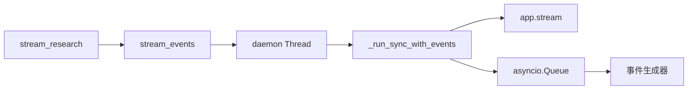
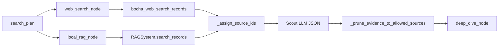

# DeepResearch 关键代码精读

## 选择标准

本篇只分析处于核心链路、承载关键决策、改变共享状态或连接外部边界的符号。先读调用关系，再读实现细节。

## 精读索引

| 优先级 | 路径与符号 | 为什么重要 | 先懂什么 |
|---|---|---|---|
| P0 | `backend/service/workflow_service.py::_run_sync_with_events` | Web 与同步 LangGraph 的事件桥 | 线程、asyncio queue、SSE |
| P0 | `mult_agents/graph.py::build_app` | 系统真实执行拓扑 | LangGraph 节点、边、状态 |
| P0 | `mult_agents/nodes.py::web_search_node/local_rag_node/deep_dive_node` | 证据生产和来源约束 | RAG、source ID、JSON fallback |
| P0 | `mult_agents/nodes.py::write_node` | 最终报告和引用安全线 | 正则、合法集合、Markdown |
| P1 | `memory/manager.py::build_personalized_prompt_context/persist_turn` | 跨轮次上下文与数据副作用 | 多后端记忆、隔离键 |
| P1 | `mult_agents/main.py::build_checkpointer` | 图状态持久化和降级 | PostgreSQL、Redis Stack、内存 |

## 1. `_run_sync_with_events`

### 为什么存在

LangGraph 的 `stream` 是同步迭代器，FastAPI SSE 端点需要异步地产生事件。该方法在后台线程执行图，`stream_events` 用线程安全方式把事件放入当前事件循环的 `asyncio.Queue`。[V][E-FLOW-003]

| 类别 | 内容 | 边界 |
|---|---|---|
| 输入 | query、tenant/user/thread、迭代和记忆开关 | 已经过 Pydantic 校验 |
| 输出 | `(final, route)` | 不直接 yield SSE 字符串 |
| 状态 | 创建全新 `ResearchState` | checkpointer 只收到 thread ID |
| 副作用 | 初始化连接、模型/检索调用、记忆读写 | 首次调用成本最高 |
| 事件 | 每个图 update 发一个 phase | 不是 token 事件 |

关键分支：若 `app.stream` 没捕获到 `final`，代码会对原始 state 再执行一次 `app.invoke`。这提高了“最终一定有值”的机会，但也可能重复模型、搜索和写入前的计算。[V][E-FLOW-003]

修改影响：更改事件类型必须同步更新 `App.vue::StreamEvent` 和解析逻辑；更改线程模型会影响 FastAPI 并发、取消传播和资源释放。

初学者误解：`async def stream_events` 不代表内部图和外部 SDK 都是异步的；实际工作在 Python 线程中。

## 2. `build_app`

### 为什么存在

它把独立节点绑定到具体 Agent，再定义唯一的有效工作流。`mult_agents/main.py` 顶部的同名节点是遗留实现，不是该图的节点来源。[V][E-ARCH-008]

| 决策 | 条件 | 后续 |
|---|---|---|
| 意图路由 | `intent == direct` | Direct → END |
| 研究路由 | 其他值 | Plan → Web + Local |
| 继续补搜 | 未达迭代上限且 `needs_more_research` | Reflect → Web + Local |
| 结束研究 | 证据足够或已达上限 | Write → END |

不变量：所有正常路径必须从 Intent 开始，并且只有 Direct/Write 连接 END。Reflect 复用 `agents.planner`，因此“八个 Agent 对象”与“九个图节点”可以同时成立。[V][E-ARCH-009][E-FLOW-004]

修改影响：新增节点时至少要同步修改 `ResearchState`、节点绑定、边、SSE 阶段文案、测试和本套文档；只写函数而不注册到图中不会生效。

设计评价：拓扑集中且清晰，但没有显式异常边、超时边或人工审核节点；错误主要向外抛出。

## 3. 检索与 `deep_dive_node`

### 调用关系

### 关键逻辑

1. `_build_queries` 首轮读 `search_plan`，补搜轮读 `supplementary_queries`。
2. 每条查询最多取四条记录，并按轮次/查询/结果生成不可歧义的 ID。
3. 先按 URL、标题、doc ID 或片段去重，再做最小非空过滤。
4. Scout LLM 只能在输入 ID 集合中选择；未知 ID 被剪掉。
5. Deep Dive 再次限制 ID，并为未被 LLM 放入池但确实存在的原始证据补评分。

| 边界条件 | 行为 | 风险 |
|---|---|---|
| 某查询无结果 | 记录 trace，继续其他查询 | 报告可能缺某子问题 |
| 整个来源无结果 | 保留已有证据并返回说明 | 另一来源仍可继续 |
| LLM JSON 非法 | 使用 raw record 生成 fallback evidence | 质量低但图不中断 |
| LLM 编造 ID | `_prune...` 删除 | 防止凭空生成来源编号 |
| 相关性低 | 当前主链只做最小非空过滤 | 已定义的相关性/域名过滤未接入 `[V][E-RISK-005]` |

修改影响：改 source ID 格式必须同步 Writer 的引用正则；启用相关性过滤会改变召回率、trace 统计和评测基线。

初学者误解：Evidence Judge 不能证明网页内容真实，它只对已检索文本做 LLM 审计和启发式评分。

## 4. `write_node`

### 输入、输出和不变量

| 类别 | 内容 |
|---|---|
| 输入 | query、sub_questions、findings、source_index、audit_flags、memory_context |
| LLM 可用来源 | `source_index` 中最多 80 个 ID |
| 输出 | Markdown `draft/final` |
| 后处理 | 去代码围栏、移除非法引用、追加参考资料 |

`_validate_and_fix_citations` 只识别形如 `[WEB1_1-1]` 的引用；不在合法集合中的匹配项会被删除。`_ensure_reference_section` 只在正文没有已有来源标题时追加自动列表。[V][E-FLOW-007]

边界：这能阻止“编号不存在”，不能验证“结论是否被该来源语义支持”。`used_citation_ids` 被计算但未用于强制覆盖率检查；无引用正文仍可能通过并附上全量来源列表。

修改影响：调整引用格式、标题或 Markdown 渲染时，要同时检查正则、`_render_reference_list`、前端渲染和面试中的“可追溯”表述。

## 5. 记忆读写

### 执行前：`build_personalized_prompt_context`

它读取用户画像、最近五条消息、滚动摘要、相关语义/任务记忆，再裁剪成 Prompt 片段，并记录一次 memory trace。[V][E-DATA-002]

### 执行后：`persist_turn`

它总是追加本轮用户和助手消息；只有 query 包含“记住、我偏好、call me”等标记才提取长期事实/偏好。可选配置还会保存一条 conversation task。[V][E-DATA-002]

| 后端 | 正常隔离 | 降级变化 |
|---|---|---|
| PostgreSQL 短期 | tenant/user/thread | 失败后进程内实现只按 thread |
| Redis 短期 | key 含 tenant/user/thread | 失败后进程内实现只按 thread |
| PostgreSQL 长期 | tenant/user，可含 thread | 失败后 SQLite 无 tenant 列 |
| Milvus 长期索引 | 查询后用元数据过滤 | 不可用时退 PostgreSQL/SQLite 搜索 |

修改影响：记忆格式会进入多个 Agent Prompt，是跨节点的隐式契约；隔离键变化还需迁移已有数据、检查清理接口和重做并发测试。

## 6. `build_checkpointer`

选择顺序是 PostgreSQL → Redis → 内存。Redis saver 依赖 RediSearch/Redis Stack；普通 Redis 触发特定错误时会降级。PostgreSQL saver 会执行 `setup()`，因此“启动研究请求”可能有建表副作用。[V][E-DATA-003]

最大的边界问题不是后端选择，而是调用图时只有 `{"configurable": {"thread_id": ...}}`；tenant/user 不属于 checkpoint namespace。[V][E-RISK-002]

## 精读完成检查

- 能解释为什么 SSE 不是 token 流。
- 能说明九个节点与八个 Agent 对象的关系。
- 能从搜索记录追踪到 Writer 合法引用。
- 能指出引用合法性与事实正确性的区别。
- 能画出记忆正常后端和降级后端的隔离差异。
