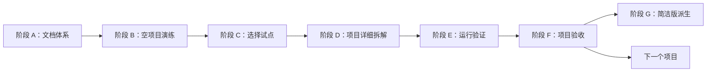

# 项目学习拆解详细实施计划

版本：0.1.0  
状态：文档体系建设阶段  
最高优先级：详细版  
当前约束：不读取 `code/` 下项目源码

## 1. 最终目标

为三个中小型完整项目建立一套统一但不僵化的学习拆解体系。每个项目完成后，学习者应能：

1. 理解项目解决的问题、使用者、产品链路和能力边界。
2. 从零准备环境、启动项目并判断是否真正可用。
3. 建立系统上下文、模块边界、数据状态和运行时协作模型。
4. 按产品链路阅读关键代码，而不是按目录逐文件浏览。
5. 追踪代表性的端到端流程，包括失败、降级和数据副作用。
6. 完成由观察到扩展的练习，并能用自己的语言讲清项目。
7. 在面试中只使用可追溯事实，不虚构指标和个人贡献。

## 2. 交付原则

- **详细版优先**：先完成并验收详细版，再派生 2 至 3 篇简洁版。
- **项目适配**：15 篇是内容契约，不要求每篇等长；简单主题可说明不适用。
- **证据优先**：每个重要结论能追溯到源码、配置、测试、运行结果或用户确认。
- **分阶段授权**：读取源码、安装依赖、启动服务和读取数据分别授权。
- **学习设计优先**：文档必须告诉读者先学什么、怎么看、如何验证学会。
- **原项目低侵入**：产物写在 `decomposition/`，默认不改 `code/`。

## 3. 总体阶段

## 4. 阶段 A：文档体系建设（当前阶段）

### A1. 明确边界和术语

交付：`README.md`、`SPEC.md`。

完成标准：

- 详细版、简洁版、证据、核心链路、代码精读和运行验证定义明确。
- 授权等级覆盖“仅文档建设”到“受控数据验证”。
- 说明不修改源码、不读密钥、不默认联网和写库。

### A2. 设计详细版信息架构

交付：`DOCUMENT-BLUEPRINT.md`、15 篇详细版模板、术语表和验收模板。

完成标准：

- 每篇有输入、输出、前置文档和验收问题。
- 文档之间不存在职责重叠或明显遗漏。
- 产品链路能映射到架构、代码、测试、练习和面试材料。
- 小项目可以合并阅读，但不丢失契约内容。

### A3. 建立证据和质量模型

交付：`SPEC.md` 的证据状态、`EVIDENCE.md` 模板、`ACCEPTANCE.md` 模板。

完成标准：

- `[R]/[V]/[C]/[I]/[U]` 使用条件可执行。
- 性能数字必须包含指标定义、数据集、环境、方法、日期和结果。
- 图、命令、路径、符号和面试声明都能做交叉检查。

### A4. 建立执行 Skill

交付：`skills/project-learning-decomposer/`。

完成标准：

- Skill 只描述稳定工作流，不塞入具体项目事实。
- 描述能准确触发完整项目拆解，不误触发普通代码解释。
- 初始化和校验脚本不读取源码、不改原项目。
- 授权边界在 Skill 中是阻断规则，不是提示建议。

### A5. 工具路线评审

交付：`TOOLING.md`。

完成标准：

- 明确 V1 为什么不需要自研 MCP。
- 定义何时才值得做 MCP，以及只读、安全和证据输出要求。
- 说明外部文档、浏览器和 Git 工具的可选使用场景。

### A6. 文档体系验收

检查项：

- [ ] 新项目可仅凭模板初始化完整工作区。
- [ ] 不读源码也能完成 G0 范围和授权。
- [ ] 每篇模板都能回答“为什么存在、依赖什么、产出什么”。
- [ ] 结构校验能发现缺文件和模板占位符。
- [ ] 人工评审能发现无证据数字、越权命令和错误状态标记。
- [ ] 用户确认文档数量、命名、学习顺序和授权流程。

## 5. 阶段 B：空项目演练

目的：在不读取三个项目的前提下验证文档系统是否自洽。

方法：使用一个虚构项目元数据，只执行初始化、填写 G0、故意保留占位符、模拟证据和阶段门。

验收场景：

1. 缺少核心链路文档时校验失败。
2. 仍有模板变量时校验失败。
3. 把静态命令写成 `[R]` 时人工验收失败。
4. 面试数字无证据时人工验收失败。
5. 未授权运行时，Skill 必须停止在授权边界。

阶段 B 不接触 `code/`，也不使用现有三个项目作为测试数据。

## 6. 阶段 C：试点准备

只有 A/B 通过且用户确认后开始。

### C1. 项目选择

选择标准：

- 入口和运行方式相对清楚。
- 外部依赖和敏感数据风险较低。
- 能覆盖产品链路、架构和至少一条端到端流程。
- 不以“旧文档最多”作为唯一选择标准。

### C2. 单项目授权卡

用户逐项确认：

- 可查看哪些目录和文件类型。
- 是否允许全局搜索源码。
- 是否允许读取测试和 Git 历史。
- 是否允许安装依赖、构建和启动。
- 是否允许本地数据库、外部 API 或浏览器验证。
- 明确排除的密钥、数据和生成目录。

默认只申请满足下一阶段所需的最小权限，不把“开始拆解”解释为全权限。

### C3. 基线冻结

记录项目路径、revision、文档版本、目标读者、已知限制和本轮不做事项。项目发生代码变化时，证据和文档需要重新评估。

## 7. 阶段 D：单项目详细拆解

### D1. 产品模型

产出：`01`、`02`。

顺序：入口可见能力 → 用户角色 → 输入输出 → 主产品链路 → 异常可见行为 → 产品边界。

### D2. 环境与架构

产出：`03` 至 `06`。

顺序：清单/配置候选 → 系统上下文 → 进程边界 → 模块依赖 → 入口和阅读路径。

### D3. 数据和核心链路

产出：`07`、一个或多个 `08`。

每条链路必须覆盖：触发、入口、校验/授权、业务决策、数据变化、外部调用、输出、失败、重试/降级、测试和验证方法。

### D4. 关键代码精读

产出：`09`。

选择 4 至 10 个高价值符号，按职责、调用者、被调用者、输入输出、副作用、不变量、边界、修改影响和替代方案讲解。禁止把目录说明改写成代码精读。

### D5. 专题与学习化

产出：`10` 至 `14` 和 `GLOSSARY.md`。

专题按项目适用性选择，但测试、调试、风险、练习和面试边界不可省略。

### D6. 学习导航回填

最后完成 `00-learning-guide.md`。它必须建立零基础路径、标准路径和时间紧张路径，不能在事实模型尚未稳定时提前定稿。

## 8. 阶段 E：运行验证

需要单独授权。推荐从低副作用到高副作用：

1. 记录运行时和工具版本。
2. 创建隔离环境，验证依赖安装。
3. 编译、类型检查和构建。
4. 启动最小依赖模式，验证健康信号。
5. 执行离线测试。
6. 验证核心 API/CLI/UI 链路。
7. 在额外授权下验证数据库或外部服务。

每条命令记录工作目录、前置条件、退出码、成功信号、副作用、脱敏输出和证据 ID。

## 9. 阶段 F：详细版验收

### 机械检查

- 文件完整、无占位符、无 TODO/TBD。
- 至少一篇 `08-core-flow-*`。
- Mermaid 围栏、链接和路径格式正确。
- 无真实密钥、DSN、用户数据和绝对个人路径。

### 事实检查

- 产品步骤与代码链路一致。
- 架构节点能定位到实现或外部系统。
- 运行命令与真实环境/端口一致。
- 失败和降级不是只写“做好异常处理”。
- 未知项没有被改写成肯定句。

### 学习检查

- 零基础读者知道先读什么、跳过什么。
- 每篇有可判断的学习结果。
- 练习包含完成标准和验证方法。
- 面试材料区分项目事实、个人贡献和未来改进。

只有所有阻断项通过或用户明确接受窄范围豁免，才能标记 G6。

## 10. 阶段 G：简洁版派生

详细版通过 G6 后生成 2 至 3 篇：

1. `quick-01-overview-and-architecture.md`：产品定位、技术栈、架构图和目录入口。
2. `quick-02-core-flow-and-key-code.md`：一条主链路、关键符号和失败边界。
3. `quick-03-run-and-interview.md`：已验证运行步骤、常见问题、面试速记和不可声称内容。

简洁版不重新分析源码，不新增数字和设计理由，并记录详细版版本。

## 11. 三项目推进策略

先完成一个项目的 G6，用真实问题修正规范和模板；再执行第二个项目验证通用性；第三个项目用于确认体系没有过度拟合。每完成一个项目，只允许改通用规范中的普遍问题，项目特例留在项目文档。

## 12. 当前下一步

1. 用户审阅本计划和文档蓝图。
2. 根据反馈调整文档数量、命名、学习路线和授权卡。
3. 做阶段 B 空项目演练。
4. 用户明确指定试点项目和可读范围后，才重新接触 `code/`。
