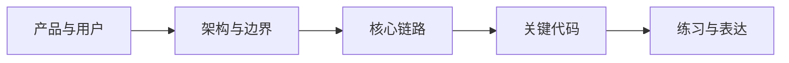

# {{PROJECT_NAME}} 学习导航

## 文档信息

- 状态：`草稿 / 已验证 / 已验收`
- 适用项目版本：`{{REVISION}}`
- 目标读者：`{{TARGET_AUDIENCE}}`
- 建议总学习时间：`{{ESTIMATED_TIME}}`
- 当前授权等级：`{{AUTH_LEVEL}}`

## 学完后应该能够

1. {{LEARNING_OUTCOME}}
2. {{LEARNING_OUTCOME}}
3. {{LEARNING_OUTCOME}}

## 前置知识

| 知识 | 要求程度 | 补充材料或说明 |
|---|---|---|
| {{TOPIC}} | 了解 / 熟悉 | {{NOTE}} |

## 项目知识地图

## 推荐阅读顺序

| 阶段 | 文档 | 目标 | 预计时间 | 完成标准 |
|---|---|---|---|---|
| 1 | `01-project-and-product.md` | {{GOAL}} | {{TIME}} | {{CHECK}} |

## 两条学习路径

### 路径 A：从零理解

{{BEGINNER_PATH}}

### 路径 B：带着问题定位

{{TASK_PATH}}

## 当前验证状态

| 范围 | 状态 | 证据 | 未解决问题 |
|---|---|---|---|
| 启动运行 | `[R/V/I/U]` | `E-...` | {{UNKNOWN}} |

## 下一步

{{NEXT_STEP}}

