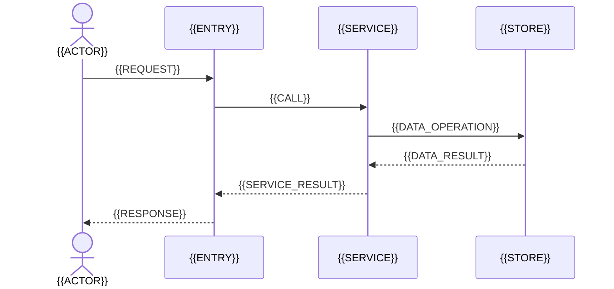

# 核心链路：{{FLOW_NAME}}

## 阅读说明

- 产品价值：{{PRODUCT_VALUE}}
- 前置知识：{{PREREQUISITES}}
- 预计时间：{{TIME}}
- 验证状态：`[R/V/I/U]`

## 一句话说明

{{ONE_SENTENCE}}

## 触发与最终结果

| 项目 | 内容 | 证据 |
|---|---|---|
| 参与者 | {{ACTOR}} | `[V/C][E-...]` |
| 触发方式 | {{TRIGGER}} | `[V/R][E-...]` |
| 输入 | {{INPUT}} | `[V][E-...]` |
| 输出 | {{OUTPUT}} | `[V/R][E-...]` |

## 端到端顺序图



## 节点追踪

| 序号 | 阶段 | 路径与符号 | 输入 | 决策或处理 | 输出与副作用 | 证据 |
|---|---|---|---|---|---|---|
| 1 | {{STAGE}} | `{{PATH}}::{{SYMBOL}}` | {{INPUT}} | {{LOGIC}} | {{OUTPUT}} | `[V][E-...]` |

## 状态变化与不变量

| 状态 | 变化前 | 触发条件 | 变化后 | 不变量 | 证据 |
|---|---|---|---|---|---|
| {{STATE}} | {{BEFORE}} | {{CONDITION}} | {{AFTER}} | {{INVARIANT}} | `[V/I][E-...]` |

## 失败、重试和降级

| 故障点 | 触发条件 | 传播方式 | 用户结果 | 重试或降级 | 覆盖测试 |
|---|---|---|---|---|---|
| {{FAILURE_POINT}} | {{CONDITION}} | {{PROPAGATION}} | {{USER_RESULT}} | {{RECOVERY}} | {{TEST}} |

## 建议代码阅读顺序

1. `{{PATH}}::{{SYMBOL}}`：{{WHY_FIRST}}
2. `{{PATH}}::{{SYMBOL}}`：{{WHY_NEXT}}

## 如何验证这条链路

```shell
{{VERIFICATION_COMMAND}}
```

预期结果：{{EXPECTED_RESULT}}

## 尚未回答的问题

{{UNKNOWNS}}

