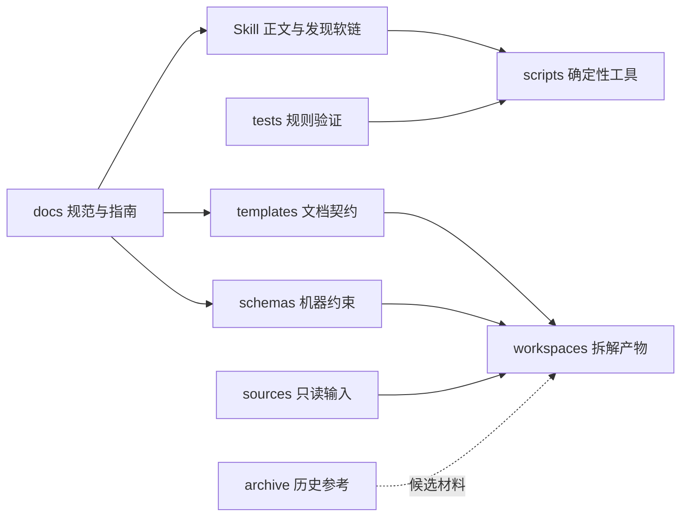

# 仓库架构

版本：0.2.0
状态：0.2 已冻结

## 架构概览

## 稳定边界

| 边界 | 输入 | 输出 | 关键约束 |
|---|---|---|---|
| 规范层 | 方法论、真实试点反馈 | 可执行规则 | 不保存具体项目事实 |
| Agent 层 | 用户请求、授权卡、规范 | 调查和写作步骤 | 不自行扩大权限 |
| 工具层 | 明确参数、工作区 | 确定性初始化与检查 | 不读取或修改源码 |
| 输入层 | 外部或本地项目源码 | 可引用实现证据 | 默认只读、逐能力授权 |
| 工作区层 | 项目证据和学习设计 | 详细拆解文档 | 详细版是事实源 |
| 归档层 | 旧拆解和冻结试点 | 历史参考 | 无当前规范效力 |

## 事实源

- 拆解方法：`docs/specifications/`
- 项目范围和权限：`workspaces/<project-id>/project.yaml`
- 项目学习事实：`workspaces/<project-id>/detailed/`（读者主面）
- 项目证据：`workspaces/<project-id>/EVIDENCE.md`（Agent 后台）
- 阶段和阻断项：`workspaces/<project-id>/ACCEPTANCE.md`（Agent 后台）

Skill、脚本和模板负责落实规范，但不能改变规范语义。若实现与规范冲突，应先停止并修正规范或实现，而不是静默选择一方。
