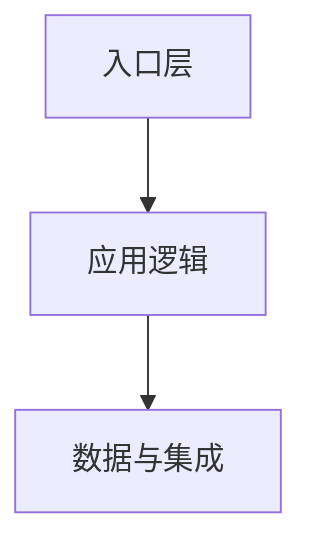

# {{PROJECT_NAME}} 架构

## 阅读说明

- 前置知识：产品链路、技术栈
- 阅读目标：理解系统边界、稳定模块和运行时协作
- 预计时间：`{{TIME}}`
- 当前把握：`尚未核对 / 已按源码核对 / 已实际跑过 / 仍有未知`

## 架构结论摘要

{{ARCHITECTURE_SUMMARY}}

## 系统上下文

```mermaid
flowchart LR
    User[{{USER}}] --> System[{{SYSTEM}}]
    System --> External[{{EXTERNAL_SYSTEM}}]
```

| 节点 | 职责 | 边界 | 定位 |
|---|---|---|---|
| {{NODE}} | {{RESPONSIBILITY}} | {{BOUNDARY}} | `{{PATH_OR_PROCESS}}` |

## 模块关系



## 运行时视图

{{RUNTIME_VIEW}}

## 数据与控制流

{{DATA_AND_CONTROL_FLOW}}

## 部署视图

{{DEPLOYMENT_VIEW}}

## 架构模式判断

只有直接材料支持时才给模式名；否则只写观察到的边界和依赖方向。

| 候选模式 | 为什么像 | 为什么不像 | 结论 |
|---|---|---|---|
| {{PATTERN}} | {{FOR}} | {{AGAINST}} | {{CONCLUSION}} |

## 关键设计决策

| 决策 | 解决的问题 | 当前收益 | 代价 |
|---|---|---|---|
| {{DECISION}} | {{PROBLEM}} | {{BENEFIT}} | {{COST}} |

## 不确定项

{{UNKNOWNS}}

## 完成判定与下一步

- 完成判定：{{COMPLETION_CHECK}}
- 下一篇：{{NEXT_DOCUMENT}}
