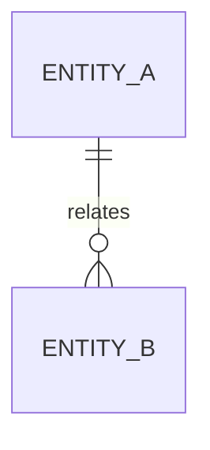
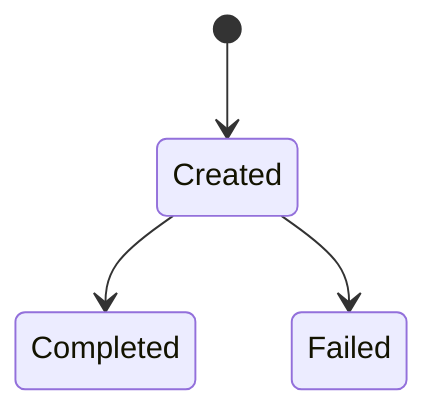

# {{PROJECT_NAME}} 核心概念、数据与状态

## 阅读说明

- 前置知识：架构和代码库地图
- 阅读目标：理解核心概念、数据边界和状态变化
- 预计时间：`{{TIME}}`
- 验证状态：`[R/V/C/I/U]`

## 核心术语和领域对象

| 概念 | 通俗解释 | 代码表示 | 生命周期 | 证据 |
|---|---|---|---|---|
| {{CONCEPT}} | {{PLAIN_EXPLANATION}} | `{{PATH}}::{{SYMBOL}}` | {{LIFECYCLE}} | `[V/C/I][E-...]` |

## 数据关系

## 数据来源与去向

| 数据 | 来源 | 处理位置 | 存储或输出 | 保留周期 | 证据 |
|---|---|---|---|---|---|
| {{DATA}} | {{SOURCE}} | `{{LOCATION}}` | {{DESTINATION}} | {{RETENTION}} | `[V/I][E-...]` |

## 状态机或生命周期

| 状态 | 进入条件 | 退出条件 | 允许操作 | 不变量 | 证据 |
|---|---|---|---|---|---|
| {{STATE}} | {{ENTER}} | {{EXIT}} | {{OPERATIONS}} | {{INVARIANT}} | `[V/I][E-...]` |

## 一致性与事务边界

{{CONSISTENCY_AND_TRANSACTIONS}}

## 敏感数据和隔离边界

{{SENSITIVE_DATA}}

## 未知项

{{UNKNOWNS}}

## 完成判定与下一步

- 完成判定：{{COMPLETION_CHECK}}
- 下一篇：{{NEXT_DOCUMENT}}
