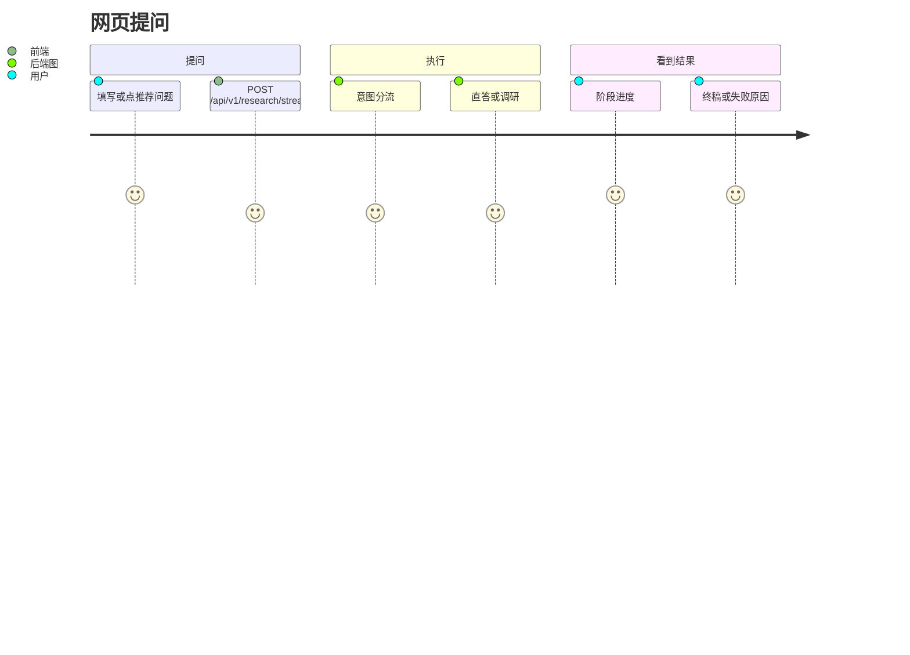

# Deep Research 产品链路

## 阅读说明

- 前置知识：项目概览
- 阅读目标：从用户行为看系统怎么选路径、前端看到什么
- 预计时间：12 分钟
- 当前把握：已按源码核对 / 还没跑过

## 用户与目标

| 用户或角色 | 目标 | 触发条件 | 期望结果 |
|---|---|---|---|
| 提问者 | 快速得到答案或一份带出处的调研 | 在聊天框回车发送 | 进度列表 + 最终 Markdown |
| 提问者 | 换一个会话键再问 | 改 User / Thread / Tenant 或点新建会话 | 记忆键变化；新建会话只清前端消息，不保证清后端记忆 |

## 产品能力边界

### 系统负责

分流、检索、裁判、成文、（可选）记忆读写，以及把阶段事件推给页面。

### 系统不负责

教你怎么写 Vue、保证检索源真实、在没密钥时仍能搜到网页。

## 主产品链路

## 链路步骤

| 步骤 | 用户行为 | 系统行为 | 结果 | 对应核心链路 |
|---|---|---|---|---|
| 1 | 输入问题并发送 | `App.vue` 的 `runResearch` POST JSON | 出现「正在处理」占位 | `08-core-flow-main.md` |
| 2 | 等待 | 后端 SSE 推 `status` / `phase` / `route` | 侧栏式进度（最多保留最近几条） | 同上 |
| 3 | 阅读 | 收到 `final` 后换成助手气泡 | Markdown 终稿 | 同上 |
| 4 | 若失败 | 收到 `error` 或 HTTP 非 2xx | 一条「请求失败：…」 | 同上 |

推荐起手问题写在前端常量里，例如「深度调研」「方案对比」；点选只是填入输入框，真正分流仍由后端做。

## 异常和退出路径

| 场景 | 用户看到什么 | 系统如何处理 | 当前把握 |
|---|---|---|---|
| 后端非 2xx 或没有 body | 失败气泡 | 前端抛错，去掉处理中占位 | 已按源码核对 |
| 图执行异常 | SSE `error`，再变成失败气泡 | `WorkflowService` 捕获后发 error 事件 | 已按源码核对，未跑过 |
| 未配博查密钥 | 调研仍可能出报告，但网页证据为空 | `bocha_web_search_records` 打日志并返回 `[]` | 已按源码核对 |
| 未配通义密钥 | 请求在初始化配置时失败 | `AppConfig.from_file` 抛错 | 已按源码核对 |

## 从产品链路到系统协作

页面只认四种业务事件类型：`status`、`phase`、`route`、`final`，外加 `error`。节点内部的 JSON 规划、证据池用户看不到，除非写进终稿。

## 完成判定与下一步

- 完成判定：能画出「发送 → 分流 → 两种结局」。
- 下一篇：`03-environment-and-runbook.md`（候选命令，未跑过）或直接 `05-architecture.md`。
