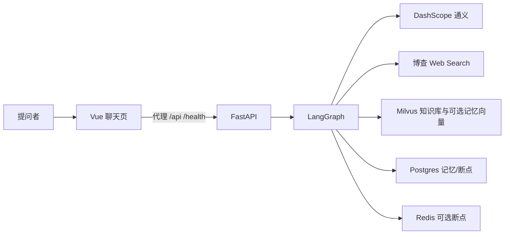
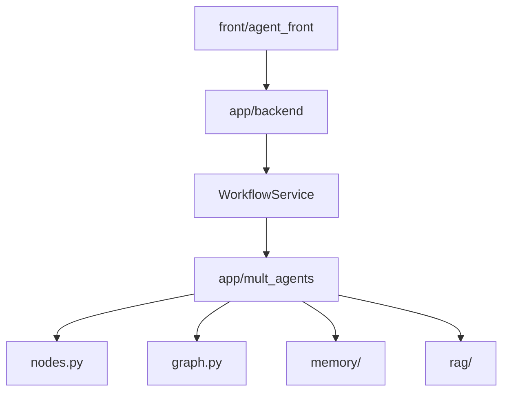

# Deep Research 架构

## 阅读说明

- 前置知识：产品链路
- 阅读目标：分清浏览器、API、图、模型、检索和记忆各自干什么
- 预计时间：15 分钟
- 当前把握：已按源码核对 / 还没跑过

## 架构结论摘要

这是「薄前端 + FastAPI 适配 + LangGraph 编排 + 外部模型/检索/存储」。HTTP 层不实现研究逻辑，只负责鉴权以外的入参、跑图、把节点进度转成 SSE。

## 系统上下文

| 节点 | 职责 | 边界 | 定位 |
|---|---|---|---|
| Vue 聊天页 | 交互、SSE 解析、终稿展示 | 不跑 Agent | `front/agent_front/src/App.vue` |
| FastAPI | HTTP、CORS、健康检查、工作流服务 | 不写研究报告 | `app/app_main.py` |
| LangGraph | 节点顺序、分流、并行检索、补搜循环 | 不直接画 UI | `app/mult_agents/graph.py` |
| 通义 | 各角色 LLM | 要 `DASHSCOPE_API_KEY` | `ChatTongyi` in `app/mult_agents/main.py` |
| 博查 | 网页检索 | 要 `BOCHA_API_KEY`，未配则空 | `bocha_web_search_records` |
| Milvus | 本地库检索、可选记忆向量 | 连不上则检索空或记忆降级 | `app/mult_agents/rag/core.py` |
| Postgres/Redis | 记忆与 checkpointer | 失败则警告并降级 | `build_memory_manager` / `build_checkpointer` |

## 模块关系

`app/mult_agents/main.py` 里还留着一套较旧的节点函数；**真正被图引用的是 `nodes.py`**。CLI 和 HTTP 都走 `build_workflow_app`。

## 运行时视图

- 浏览器：Vite `:5173`，开发时把 API 转到 `:8000`。
- API 进程：`uvicorn` 加载 `app_main:app`，默认 `0.0.0.0:8000`。
- 图执行：`WorkflowService` 用线程跑同步 `stream`/`invoke`，再用队列把事件送回 FastAPI 的异步生成器。所以「流式」是节点级进度，不是 token 级打字机。

## 数据与控制流

请求级：query + 三个 ID。  
图状态：`ResearchState`（计划、两路证据、审计标记、是否还要补搜、final 等）。  
记忆：执行前 `build_personalized_prompt_context`，执行后 `persist_turn`。

## 部署视图

源码里没有 docker-compose。默认全部指向本机：Postgres、Redis `6379`、Milvus `19530`。是否真有这些进程，本轮未验证。

## 架构模式判断

| 候选模式 | 为什么像 | 为什么不像 | 结论 |
|---|---|---|---|
| 多智能体图编排 | 多个命名 agent + StateGraph 条件边 | 多数节点并不绑工具，检索是节点里直接调函数 | 是图编排；不要理解成每个角色都自己调工具 |
| BFF + 单页应用 | Vue 调本机 API | 前端 README 仍是模板，也没有独立网关服务 | 就是开发代理，不是单独 BFF 服务 |

## 关键设计决策

| 决策 | 解决的问题 | 当前收益 | 代价 |
|---|---|---|---|
| 意图先分流 | 避免所有问题都走贵链路 | 简单问题短路径 | 规则词表很宽，「分析」「数据」等也容易进调研 |
| 计划后两路检索再汇合 | 网上 + 本地同时用 | 覆盖面 | 任一路失败就空列表，图仍继续 |
| SSE 按节点推进度 | 让页面知道卡在哪 | 可调试 | 不是模型 token 流 |
| 配置环境变量优先于 `config.json` | 本地/密钥不进仓库 | 常见 12-factor | 两套配置文件容易看岔 |

## 不确定项

- LangGraph 对 `plan` 两条出边是否严格等待两路都完成，未运行确认。
- 并行节点写入未带 reducer 的 list 字段时，会不会互相覆盖，未运行确认。

## 完成判定与下一步

- 完成判定：能指出前端、API、图、三个外部系统的边界。
- 下一篇：`06-codebase-map.md`
