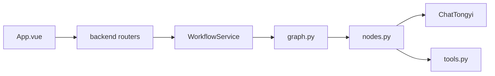

# Deep Research 入口与模块地图

## 阅读说明

- 前置知识：架构
- 阅读目标：知道该打开哪些目录，而不是按文件精读
- 预计时间：10 分钟
- 当前把握：已按源码核对 / 还没跑过

本篇是地图，不是阅读课。

## 顶层结构

```text
sources/deep_research/
├── main.py                 # CLI 启动：加载 .env，转入 mult_agents.main
├── config.json             # 模型与存储配置（api_key 目前为空）
├── .env.example            # 环境变量名；没有 BOCHA_API_KEY
├── pyproject.toml          # 包名 mult_agents，Python 依赖
├── requirements.txt        # 钉死版本的依赖清单
├── app/
│   ├── app_main.py         # FastAPI 应用
│   ├── backend/            # HTTP：路由、入参、WorkflowService
│   ├── mult_agents/        # 图、节点、工具、记忆、RAG
│   ├── data/memory.db      # 本地库文件，拆解时不读内容
│   └── test/               # 几乎只有博查手工脚本
└── front/agent_front/      # Vue 3 + Vite 聊天页
```

## 关键目录与模块

| 路径 | 职责 | 主要入口 | 上游 | 下游 |
|---|---|---|---|---|
| `front/agent_front/src/App.vue` | 聊天与 SSE | 用户发送 | 浏览器 | FastAPI |
| `app/app_main.py` | 组装 FastAPI | `create_app` | uvicorn | 路由 |
| `app/backend/router/research_router.py` | `/run` `/stream` | HTTP | 前端/调用方 | WorkflowService |
| `app/backend/service/workflow_service.py` | 初始化图、流式事件 | `stream_events` | 路由 | LangGraph |
| `app/mult_agents/graph.py` | 节点和边 | `build_app` | WorkflowService / CLI | nodes |
| `app/mult_agents/nodes.py` | 各阶段业务 | `intent_node` 等 | graph | tools / LLM |
| `app/mult_agents/tools.py` | 博查与 RAG 查询 | `bocha_web_search_records` | nodes | 外部 HTTP / Milvus |
| `app/mult_agents/memory/` | 短长期记忆 | `MemoryManager` | WorkflowService | PG/Redis/Milvus/SQLite |
| `app/mult_agents/main.py` | Agent 工厂、CLI、checkpointer | `build_agents` | 两边入口 | ChatTongyi |

## 入口清单

| 入口类型 | 定位 | 触发方式 | 对应产品场景 |
|---|---|---|---|
| UI | `App.vue` `runResearch` | 回车或发送按钮 | 主旅程 |
| HTTP | `POST /api/v1/research/stream` | fetch / curl | 主旅程 |
| HTTP | `POST /api/v1/research/run` | 一次性 JSON | 不要进度只要终稿 |
| HTTP | `GET /health` | 探活 | 运行是否起来（未验证） |
| CLI | `main.py` | 命令行 | 同一套图 |

## 模块依赖方向



## 协作时先看哪里

| 顺序 | 定位 | 要搞清什么 | 暂时跳过什么 | 完成标准 |
|---|---|---|---|---|
| 1 | `App.vue` 里 `runResearch` | 前端交给后端什么、认哪些 SSE | CSS、脚手架组件 | 能说出 JSON 字段和事件类型 |
| 2 | `research_router.py` + `workflow_service.py` | HTTP 如何驱动图 | 线程队列细节可后看 | 知道进度从哪来 |
| 3 | `graph.py` | 直答 vs 调研怎么走 | `main.py` 里重复的旧节点 | 能画边 |
| 4 | `nodes.py` 的 intent / web_search / analyze | 关键判断 | 超长 prompt 字符串 | 能讲分流和空检索 |

## 先不必看的区域

| 区域 | 原因 | 何时再看 |
|---|---|---|
| `front/agent_front/src/components/HelloWorld.vue` 等 | 脚手架残留，App 未使用 | 永远不必当产品代码 |
| `front/agent_front/README.md` | 模板说明，过时 | 不要当启动真相 |
| `app/data/memory.db` | 运行数据 | 未授权读库 |
| `app/mult_agents/main.py` 中与 `nodes.py` 重复的 node 函数 | 图不引用它们 | 对比历史实现时 |

## 命名与约定

HTTP 应用名：`DeepResearch Multi-Agent Assistant`。健康检查 service 字段：`deepresearch-backend`。前端品牌文案：DeepResearch。Python 发行名：`mult_agents`。三套名字并存。

## 完成判定与下一步

- 完成判定：能按「页面 → 路由 → 服务 → 图 → 节点」指到路径。
- 下一篇：`07-domain-and-data.md` 或 `08-core-flow-main.md`
