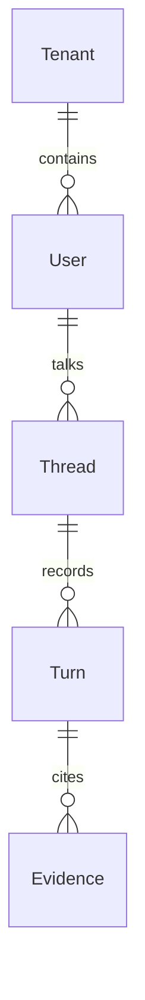
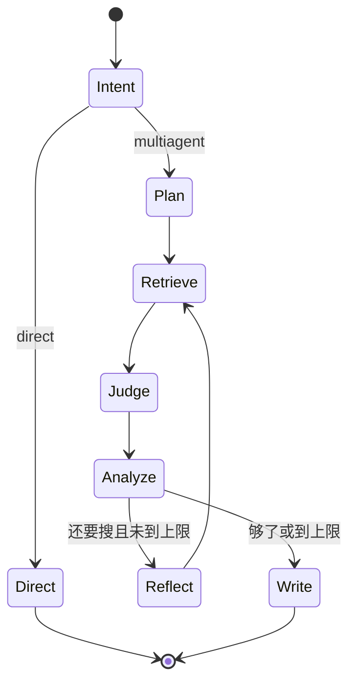

# Deep Research 核心概念、数据与状态

## 阅读说明

- 前置知识：架构和模块地图
- 阅读目标：分清请求身份、图状态和记忆，不要把它们混成「一个数据库」
- 预计时间：10 分钟
- 当前把握：已按源码核对 / 还没跑过

## 核心术语和领域对象

| 概念 | 在本项目中的含义 | 主要落点 | 生命周期 |
|---|---|---|---|
| query | 用户问题原文 | ResearchRequest / ResearchState | 单次任务 |
| intent | `direct` 或 `multiagent` | `intent_node` | 单次任务 |
| thread_id | 会话/图断点键 | 请求 JSON、checkpointer configurable | 跨请求（若存储可用） |
| user_id / tenant_id | 记忆隔离键 | MemoryManager | 跨请求 |
| evidence_pool | 裁判后的证据集合 | `deep_dive_node` | 单次任务 |
| final | 给用户看的正文 | 直答或 write | 单次任务结束时产生 |
| memory_context | 注入 prompt 的历史摘要/记忆 | 执行前构建 | 每轮重新取 |

## 数据关系

上图是理解用，不是数据库 schema 导出。源码没有完整 ORM 模型文档。

## 数据来源与去向

| 数据 | 来源 | 处理位置 | 存储或输出 | 保留周期 |
|---|---|---|---|---|
| 用户问题 | 网页/API | 图 | 记忆 persist_turn（若开启） | 视后端 |
| 网页摘要 | 博查 | web_search_node | 进入 state，可能进报告 | 任务内 |
| 本地片段 | Milvus | local_rag_node | 同上 | 视知识库 |
| 图进度 | 节点名 | WorkflowService | SSE，不落库 | 当时 |
| 终稿 | LLM write/direct | state.final | 返回前端；记忆里存问答 | 视后端 |

## 状态机或生命周期

| 状态 | 进入条件 | 退出条件 | 允许操作 | 不变量 |
|---|---|---|---|---|
| Intent | START | 得到 route | 规则+LLM | 只能两种 route |
| Retrieve | plan 或 reflect 之后 | 两路节点结束 | 外部 IO | 允许结果为空 |
| Analyze | deep_dive 之后 | write 或 reflect | 只读证据池 | max_iterations 封顶 |

## 一致性与事务边界

未见跨存储事务。记忆写入发生在图跑完之后；图成功但记忆失败时，用户仍可能看到终稿。

## 敏感数据和隔离边界

密钥在 `.env` / 环境变量，不在前端。拆解不读 `.env` 和 `memory.db`。前端把 user/thread/tenant 当明文输入，没有鉴权层。

## 未知项

SQLite `app/data/memory.db` 何时作为后端、里面有什么，未读库故不知。

## 完成判定与下一步

- 完成判定：能分开「一次任务的图状态」和「跨任务的记忆键」。
- 下一篇：`08-core-flow-main.md`
