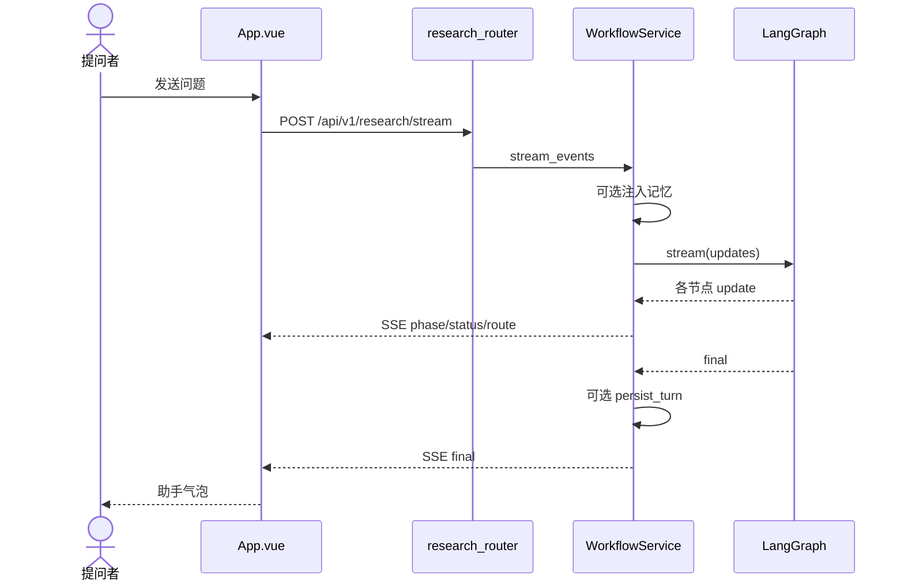

# 核心链路：网页提问到研究报告

## 阅读说明

- 产品价值：用户只提交一个问题，看到要么快答、要么带出处的研报
- 前置知识：产品链路、架构、模块地图
- 预计时间：20 分钟
- 当前把握：已按源码核对 / 还没跑过

## 一句话说明

浏览器 POST 流式接口，后端在线程里跑 LangGraph，按节点把进度推回页面，最后给 `final`。

## 触发与最终结果

| 项目 | 内容 |
|---|---|
| 参与者 | 提问者 |
| 触发方式 | `App.vue` `runResearch` → `POST /api/v1/research/stream` |
| 输入 | `{ query, user_id, thread_id, tenant_id }` |
| 输出 | SSE 事件，终局为 `type=final` 的正文，或 `type=error` |

## 端到端顺序图



## 节点追踪

| 序号 | 阶段 | 定位 | 输入 | 决策或处理 | 输出与副作用 |
|---|---|---|---|---|---|
| 1 | 前端发请求 | `App.vue` `runResearch` | 文本 + 三个 ID | 无本地分流 | fetch SSE |
| 2 | 接任务 | `stream_research` | ResearchRequest | 先推一条「任务已接收」 | SSE status |
| 3 | 准备图 | `WorkflowService._ensure_initialized` | `config.json` / 环境变量 | 缺通义密钥则失败 | 进程内单例图 |
| 4 | 记忆注入 | `build_personalized_prompt_context` | user/thread/tenant/query | 记忆关闭或失败则空上下文 | `memory_context` |
| 5 | 意图 | `intent_node` | 问题 | 规则初判 + LLM JSON `direct\|multiagent` | `intent` |
| 6a | 直答 | `direct_answer_node` | 问题 + 记忆 | 一次 LLM | `final`，图结束 |
| 6b | 规划 | `plan_node` | 问题 | JSON 大纲，失败用默认大纲 | `search_plan` |
| 7 | 双源检索 | `web_search_node` / `local_rag_node` | search_plan | 博查 / Milvus；失败返回空列表 | 证据列表 |
| 8 | 裁判 | `deep_dive_node` | 两路证据 | 审计标记 | `evidence_pool` |
| 9 | 分析 | `analyze_node` | 证据池 | 是否 `needs_more_research` | findings |
| 10 | 补搜或成文 | `reflect_node` 或 `write_node` | 缺口或 findings | 迭代计数到 `max_iterations` 则必须写 | 新查询或 Markdown `final` |
| 11 | 收尾 | `persist_turn` + SSE route/final | 终稿 | 写记忆 | 前端换气泡 |

## 状态变化与不变量

| 状态 | 变化前 | 触发条件 | 变化后 | 不变量 |
|---|---|---|---|---|
| intent | 空 | intent 节点返回 | `direct` 或 `multiagent` | 非法值回退规则引擎 |
| iteration | 0 | 每次 reflect | +1 | `>= max_iterations` 不再补搜 |
| final | 空 | 直答或 write | 给用户的正文 | 流式接口以 SSE final 为准 |
| 前端 loading | false | 发送 | true，结束或失败后 false | 发送中不能再发 |

## 失败、重试和降级

| 故障点 | 触发条件 | 传播方式 | 用户结果 | 重试或降级 | 覆盖测试 |
|---|---|---|---|---|---|
| 缺 DASHSCOPE_API_KEY | 初始化配置 | 异常 → SSE error | 请求失败文案 | 无自动重试 | 无 |
| 缺 BOCHA_API_KEY | 网页检索 | 返回 `[]` | 调研可能很空仍出报告 | 降级为空证据 | 仅手工脚本 |
| Milvus/RAG 失败 | 本地检索 | 空列表或初始化失败日志 | 同上 | 降级 | 无 |
| 记忆初始化失败 | MemoryManager 异常 | 日志，返回 None | 无个性化，链路仍跑 | 降级 | 无 |
| HTTP/SSE 失败 | 网络或 5xx | 前端 catch | 失败气泡 | 用户手动重发 | 无 |

图内 `analyze` 认为证据不够会 `reflect` 再搜，这是业务补搜，不是传输层重试。

## 关键节点顺序

1. `front/agent_front/src/App.vue`：契约和用户可见失败。
2. `app/backend/router/research_router.py`：两条 HTTP。
3. `app/backend/service/workflow_service.py`：线程、SSE 映射、记忆时机。
4. `app/mult_agents/graph.py`：边。
5. `app/mult_agents/nodes.py` 的 `intent_node`、`web_search_node`、`analyze_node`、`write_node`。

## 如何验证这条链路

未获运行许可，下面只是源码里的候选，**还没跑过**。

```shell
# 候选：后端（工作目录需能 import app_main，以源码为准）
# uvicorn：app/app_main.py 里写的是 "app_main:app"，port 默认 8000

# 候选：前端
# cd front/agent_front && npm run dev   # 代理到 8000
```

预期结果：健康检查返回 `status=ok`；发一个带「调研」的问题应走 multiagent，并在页面上出现 phase 日志。当前均为未验证。

## 尚未回答的问题

- 两路检索是否总是汇合后再 deep_dive。
- 页面「新建会话」是否清除服务端该 thread 的记忆（前端只清消息数组）。
- 真实博查/通义超时后用户等待多久。

## 完成判定与下一步

- 完成判定：能讲清直答和调研两条分支，以及前端只看到哪些事件。
- 下一篇：`09-capabilities-and-thinking.md`
