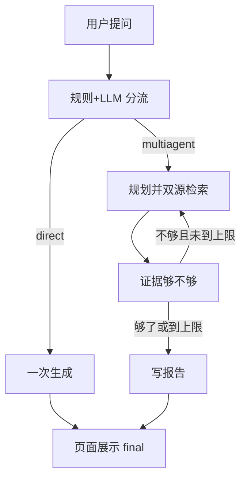

# Deep Research 业务能力与思路

## 阅读说明

- 前置知识：产品链路和架构
- 阅读目标：理解能办成什么、关键如何判断、前端参与到哪
- 预计时间：15 分钟
- 当前把握：已按源码核对 / 还没跑过

## 一句话

先判断「要不要兴师动众去检索」，再决定是一张嘴回答还是走调研流水线。

## 能力地图

| 能力 | 为谁解决什么 | 系统负责到哪 | 不负责什么 | 前端参与到哪 |
|---|---|---|---|---|
| 意图分流 | 别让闲聊也跑完整调研 | 给出 `direct` 或 `multiagent` | 不保证分类总符合用户心理 | 不参与判断，只展示后续路线文案 |
| 快速直答 | 低成本问答 | 一次 LLM 出 `final` | 不引用网页证据 | 显示终稿 |
| 规划调研 | 把问题拆成可搜的大纲 | JSON 大纲和 search_plan | 不保证大纲质量 | 只显示「Planner 正在拆解」类进度 |
| 双源取证 | 网上 + 本地 | 调博查和 Milvus | 不保证来源真实或库里有货 | 不展示原始命中列表（除非写进报告） |
| 证据裁判 | 过滤、打标 | audit_flags + evidence_pool | 不是法律意义上的事实核查 | 进度文案 Evidence Judge |
| 补搜 | 缺口再找一轮 | reflect 产生新 query | 有轮次上限 | 进度 |
| 写报告 | 可读的 Markdown | write 节点约束引用 ID | 不保证引用都点得开 | 浅 Markdown 渲染 |
| 记忆 | 跨轮更稳 | 执行前注入、执行后写入 | 前端新建会话不等于服务端失忆 | 只提供三个 ID 输入框 |

## 能力边界

### 能做

按问题类型走两条路径；复杂路径里并行搜网和搜库；用阶段事件让人知道跑到哪。

### 故意不做或交给外部

网页搜索交给博查；向量和部分记忆交给 Milvus/Postgres/Redis；生成交给通义。前端不实现任何上述能力。

## 关键业务判断

| 场景 | 依据什么判断 | 系统怎么裁决 | 用户看到什么 | 判断错会怎样 |
|---|---|---|---|---|
| 是否深度调研 | `detect_intent` 关键词 + LLM 的 route | 只接受 `direct` / `multiagent`，非法回退规则 | SSE `route` 文案 | 简单问题被拉去检索，又慢又空 |
| 关键词表 | 「调研、来源、趋势、对比、报告、数据…」 | 命中则倾向 multiagent | 无单独提示 | 词表很宽，很多问题都会进调研 |
| 要不要再搜 | `analyze` 的 `needs_more_research` | true 则 reflect，但 iteration ≥ max 则必须 write | 更多 phase | 可能轮转几次才出报告 |
| 没搜到东西 | 密钥缺失或服务挂 | 空列表，流水线不停 | 仍可能出一篇弱报告 | 看起来「成功」但没有来源 |
| 记忆用哪套键 | 请求里的三个 ID | 后端按键读写 | 侧栏可改，默认 user01/thread01 | 改错 ID 会串会话或以为没记忆 |

## 默认思路

处理问题时先问：这是不是「要证据、要对比、要最新」的任务？是就走流水线；不是就直答。流水线里「检索失败」不等于「任务失败」。

## 前端参与边界

| 环节 | 前端做什么 | 决策在哪一侧 | 前端不该假定什么 |
|---|---|---|---|
| 提问 | 组 JSON、开 fetch 流 | 后端 | 不要在浏览器里做意图分类 |
| 进度 | 解析 SSE，拼接最近几条 | 后端 node 名 | 不要当成 token 流 |
| 终稿 | 浅 Markdown → HTML | 后端 write/direct | 不要以为能渲染完整 GFM |
| 会话 | 清本地 messages | 记忆在后端 | 新建会话已清空记忆 |
| 身份 | 三个 ID 输入框 | 后端存储键 | 这就是登录用户 |

## 常见想错的方式

| 容易怎么理解 | 实际是怎样 | 为什么会错 |
|---|---|---|
| 每个 Agent 都会自己调搜索工具 | 检索多半是节点里直接调 `bocha_web_search_records` / RAG，agent 常是空工具的 JSON 抽取器 | `build_agents` 里 tools 传了 `[]` |
| 前端 README 能说明怎么用 | 仍是 Vite 模板说明 | 产品 UI 已经换成聊天工作台 |
| 配了通义就能搜网页 | 网页检索另要 `BOCHA_API_KEY` | example 环境文件没写这项 |
| 流式等于边生成边出字 | 按图节点推一次进度 | `stream_mode="updates"` |

## 和相邻文档的关系

- 产品定位见 `01-project-and-product.md`
- 用户步骤见 `02-product-journeys.md`
- 概念和数据见 `07-domain-and-data.md`
- 一条路径怎么跑见 `08-core-flow-main.md`

## 尚未确定

规则和 LLM 同时参与分流时，以谁为准的体验（源码是 LLM 优先、非法再回退规则）。未跑样本，不知道实际有多爱走调研。

## 完成判定与下一步

- 完成判定：能讲分流标准、空检索仍继续、前端决策边界。
- 下一篇：`10-interfaces-and-integrations.md`
