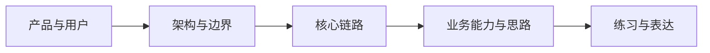

# Empty Drill 学习导航

## 文档信息

- 状态：`草稿 / 已核对 / 已验收`
- 适用项目版本：`{{REVISION}}`
- 目标读者：`{{TARGET_AUDIENCE}}`
- 建议总学习时间：`{{ESTIMATED_TIME}}`
- 当前许可：`{{AUTH_SUMMARY}}`

## 看完后应该能够

1. {{LEARNING_OUTCOME}}
2. {{LEARNING_OUTCOME}}
3. {{LEARNING_OUTCOME}}

## 需要先具备什么

| 知识 | 要求程度 | 说明 |
|---|---|---|
| {{TOPIC}} | 了解 / 熟悉 | {{NOTE}} |

## 项目知识地图

## 推荐阅读顺序

| 阶段 | 文档 | 目标 | 预计时间 | 完成标准 |
|---|---|---|---|---|
| 1 | `01-project-and-product.md` | {{GOAL}} | {{TIME}} | {{CHECK}} |

## 两条路径

### 路径 A：按协作把项目看懂

{{BEGINNER_PATH}}

### 路径 B：带着问题定位

{{TASK_PATH}}

## 当前把握

| 范围 | 把握 | 还没解决的问题 |
|---|---|---|
| 启动运行 | `尚未核对 / 已按源码核对 / 已实际跑过 / 仍有未知` | {{UNKNOWN}} |

## 下一步

{{NEXT_STEP}}
