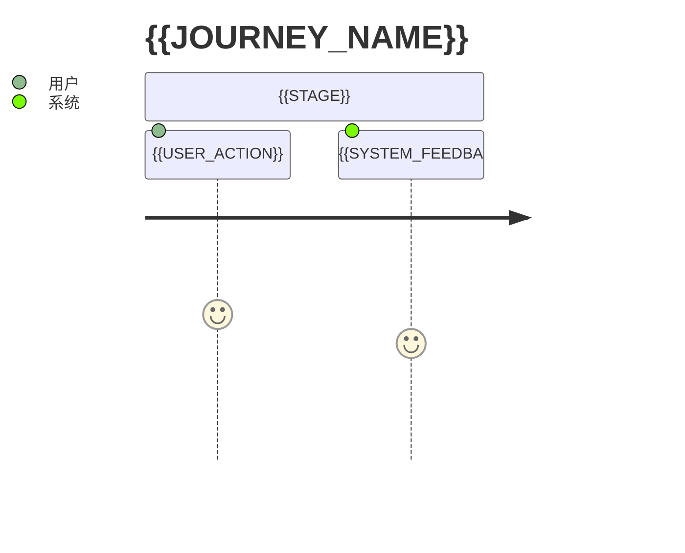

# Empty Drill 产品链路

## 阅读说明

- 前置知识：项目概览
- 阅读目标：从用户行为理解系统能力和后续协作主线
- 预计时间：`{{TIME}}`
- 当前把握：`尚未核对 / 已按源码核对 / 已实际跑过 / 仍有未知`

## 用户与目标

| 用户或角色 | 目标 | 触发条件 | 期望结果 |
|---|---|---|---|
| {{ACTOR}} | {{GOAL}} | {{TRIGGER}} | {{RESULT}} |

## 产品能力边界

### 系统负责

{{IN_SCOPE}}

### 系统不负责

{{OUT_OF_SCOPE}}

## 主产品链路

## 链路步骤

| 步骤 | 用户行为 | 系统行为 | 结果 | 对应核心链路 |
|---|---|---|---|---|
| 1 | {{ACTION}} | {{BEHAVIOR}} | {{RESULT}} | `08-core-flow-...` |

## 异常和退出路径

| 场景 | 用户看到什么 | 系统如何处理 | 当前把握 |
|---|---|---|---|
| {{FAILURE}} | {{VISIBLE_RESULT}} | {{HANDLING}} | {{STATUS}} |

## 从产品链路到系统协作

{{BRIDGE_TO_COLLABORATION}}

## 完成判定与下一步

- 完成判定：{{COMPLETION_CHECK}}
- 下一篇：{{NEXT_DOCUMENT}}
