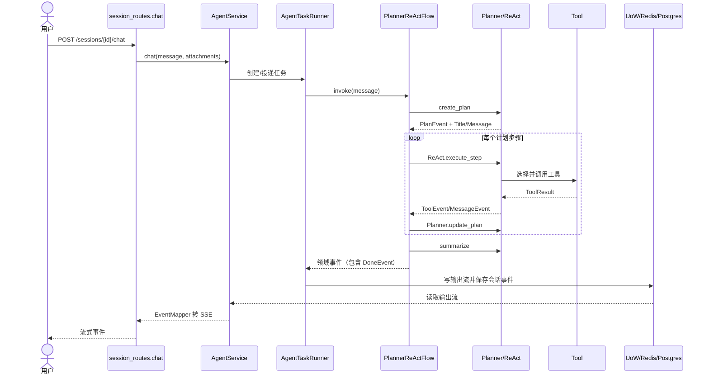

# 核心链路：会话发送任务并流式执行

## 阅读目标
把一次聊天请求从 API 入口追到 Planner、ReAct、工具、持久化和 SSE 结束事件。

## 触发与结果
用户调用 `POST /api/sessions/{session_id}/chat`，请求包含 message、附件、event_id 和 timestamp。最终返回一串 SSE 事件：计划、消息、工具状态、等待/错误以及 `DoneEvent`；会话和事件同时写入仓库。

## 关键节点

| 顺序 | 定位 | 作用 |
|---|---|---|
| 1 | `interfaces/endpoints/session_routes.py: chat` | 接收请求并把领域事件映射成 SSE |
| 2 | `application/services/agent_service.py` | 调度会话任务与事件流 |
| 3 | `domain/services/agent_task_runner.py` | 连接任务队列、Flow、事件持久化和附件同步 |
| 4 | `domain/services/flows/planner_react.py: invoke` | 管理 IDLE/PLANNING/EXECUTING/UPDATING/SUMMARIZING 状态 |
| 5 | `domain/services/agents/planner.py` / `react.py` | 生成计划、执行步骤、更新计划、总结 |
| 6 | `domain/services/tools/*.py` | 把模型选择转为文件、Shell、浏览器、搜索、MCP 或 A2A 操作 |

## 状态变化

`SessionStatus.PENDING` 进入 `RUNNING`；Flow 在规划、执行、更新、总结和完成之间循环；计划步骤从待执行变为运行/完成。每次领域事件先写入任务输出流，再由 UoW 写入会话事件。

## 失败、重试和降级

会话不存在由 AgentService 捕获后产生 ErrorEvent。BaseAgent 对模型调用异常和工具抛出的异常按 AgentConfig.max_retries 重试（默认 3 次），工具耗尽后返回 success=false 的 ToolResult；工具直接返回失败结果不会自动再次执行。跨服务恢复没有经完整部署验证。领域层实验确认了迭代边界及步骤失败状态覆盖的问题，见 [源码学习](source-study-guide.md)。

## 验证方法

静态验证：核对上述路径、事件模型和 Flow 状态。运行验证需先启动 PostgreSQL、Redis、API、UI 和 sandbox，并使用测试会话发送一条无外部写入任务；不得把 README 的 `docker compose up` 当作成功证据。

## 完成判定

能说明请求、计划、步骤执行、工具结果、计划更新、总结、持久化和 SSE 结束事件的顺序，并能指出至少一个外部依赖失败如何传播。
