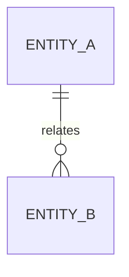
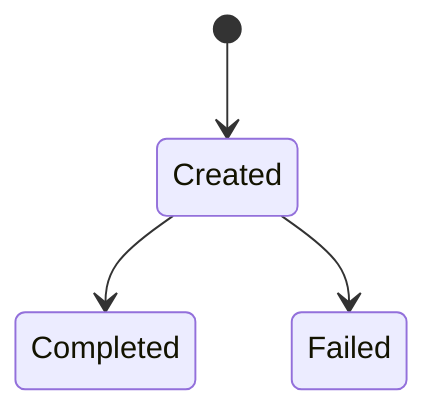

# MoocManus / IMooc MAS 核心概念、数据与状态

## 阅读说明

- 前置知识：架构和模块地图
- 阅读目标：理解核心概念、数据边界和状态变化
- 预计时间：`{{TIME}}`
- 当前把握：`尚未核对 / 已按源码核对 / 已实际跑过 / 仍有未知`

## 核心术语和领域对象

| 概念 | 在本项目中的含义 | 主要落点 | 生命周期 |
|---|---|---|---|
| {{CONCEPT}} | {{PROJECT_MEANING}} | `{{LOCATION}}` | {{LIFECYCLE}} |

## 数据关系

## 数据来源与去向

| 数据 | 来源 | 处理位置 | 存储或输出 | 保留周期 |
|---|---|---|---|---|
| {{DATA}} | {{SOURCE}} | `{{LOCATION}}` | {{DESTINATION}} | {{RETENTION}} |

## 状态机或生命周期

| 状态 | 进入条件 | 退出条件 | 允许操作 | 不变量 |
|---|---|---|---|---|
| {{STATE}} | {{ENTER}} | {{EXIT}} | {{OPERATIONS}} | {{INVARIANT}} |

## 一致性与事务边界

{{CONSISTENCY_AND_TRANSACTIONS}}

## 敏感数据和隔离边界

{{SENSITIVE_DATA}}

## 未知项

{{UNKNOWNS}}

## 完成判定与下一步

- 完成判定：{{COMPLETION_CHECK}}
- 下一篇：{{NEXT_DOCUMENT}}
