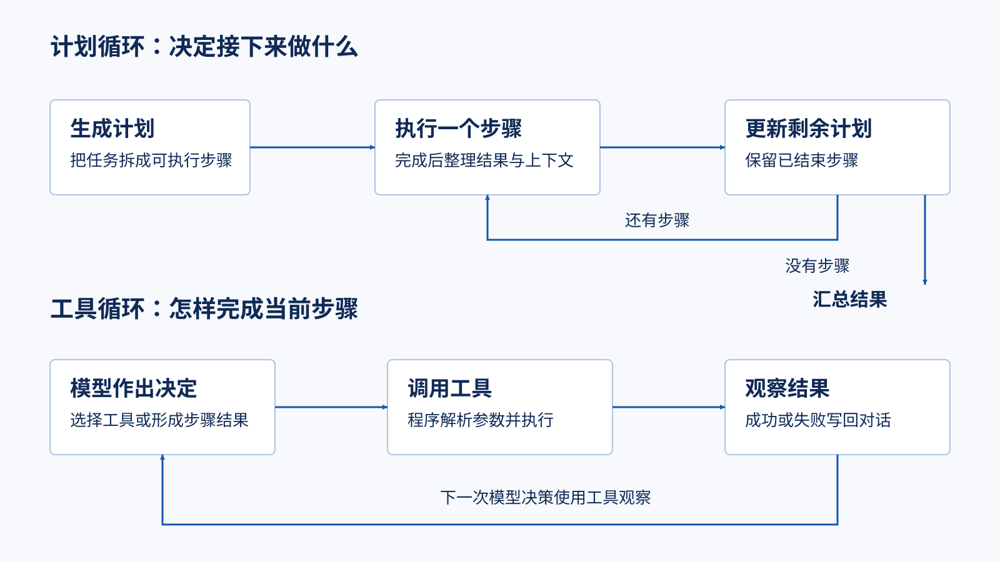

# MoocManus：从一次任务理解双层 Agent 循环

这篇面向已经会编程、但尚未实现 Agent 系统的读者。目标是读完能解释控制权如何在程序、模型与工具之间转移，随后运行本页配套实验。以下内容已核对源码，并用假模型执行原领域层；网页、真实模型和完整部署还没有跑通。

先记住一个问题：**模型返回了一次答案，为什么系统还要继续运行？** 因为模型可能只是在要求调用工具；即使一个步骤结束，整个计划也可能还没有完成。这是本项目必须分开理解的两层循环。



上半部分负责整项任务，下半部分展开了“执行一个步骤”的主要机制。图省略队列、数据库和人工暂停，它们在后文解释。Planner 通常生成结构化计划，ReAct 才按步骤使用工具；不能把两个名字理解为两个独立部署的服务。

## 开篇：先让用户任务变得具体

设想用户要求“比较两个方案，把结果写成文档”。系统不应只返回一句模型回复：它需要计划、检索或浏览、整理内容，可能还要写文件。页面看见的计划、工具进度和结果不是凭空生成的动画，而是领域事件的呈现。

`mooc-manus/api/app/interfaces/endpoints/session_routes.py` 的 `chat` 接收 message、附件 ID 和恢复读取用的 event_id，把 `AgentService.chat` 产出的事件交给 EventMapper 转为 SSE。会话建立、任务执行与浏览器连接是不同用例。附件在请求里是文件 ID，不是直接给 LLM 的二进制内容。

第一遍源码阅读只需沿下表前进。文中以 `mooc-manus/api/app/` 为主要代码根，不把所有目录都设为必读。

| 要回答的问题 | 代码落点 | 先看什么 |
|---|---|---|
| 用户发送后发生什么 | `application/services/agent_service.py` | 创建任务、输入事件与读取输出流 |
| 谁实际推进工作 | `domain/services/agent_task_runner.py` | `invoke`、`_run_flow`、`_put_and_add_event` |
| 一项任务怎样拆分和重规划 | `domain/services/flows/planner_react.py` | `invoke` 的状态分支 |
| 一步怎样调用工具 | `domain/services/agents/base.py` | `invoke`、`_invoke_llm`、`_invoke_tool` |
| 模型结果怎样变成业务对象 | `agents/planner.py`、`agents/react.py` | Plan/Step 解析、等待和结果 |

## 外层循环：计划不是一次生成后永久不变

`PlannerReActFlow` 建立 Planner 与 ReAct，共用工具对象列表，但各自按 Agent 名称保存记忆。Planner 的 `_tool_choice` 是 `none`，即使有工具声明也要求模型输出计划；这避免把“模型知道工具有哪些”误解成“规划阶段正在执行工具”。

Flow 先查会话，进入 PLANNING 后调用 `create_plan`。Planner 将用户请求编入提示词，通过 BaseAgent 获取消息，再经 JSONParser 与 Pydantic 转成 Plan。PlanEvent(created) 还会触发标题和初始助手消息。

随后 `Plan.get_next_step()` 寻找第一个尚未结束的步骤。ReAct 执行该步骤后，Flow 压缩执行记忆，再请 Planner 更新剩余计划。`update_plan` 保留第一个未结束步骤之前的前缀，把后续步骤替换为新计划中的步骤。这意味着新增能力或发现问题可以改变之后的工作，而不是每次推倒所有历史结果。

例如原计划是 A、B、C，A 已结束，更新生成 D、E，则结果是 A、D、E。配套 `test_planner_preserves_completed_prefix` 已在原 Planner 上验证这个语义。不要把更新理解成给原列表简单追加步骤。

原 `Step.done` 将 completed 和 failed 都视为结束，因此“没有下一步”不证明每一步都成功。Flow 取不到下一步时进入 SUMMARIZING，ReAct 汇总历史消息，随后发出计划完成和 DoneEvent。业务成功、程序结束、用户已收到结果需要分别判断。

## 内层循环：模型提议，程序执行，观察返回模型

BaseAgent 首次把用户输入存入记忆，附带工具声明请求模型。响应如果带 `tool_calls`，程序解析 arguments，找到拥有该函数名的工具集，先发 calling 事件，再调用工具，发 called 事件，最后将 ToolResult 序列化为 `role=tool` 的消息返回模型。

```json
{"role":"tool","tool_call_id":"call-1","function_name":"echo","content":"{\"success\":true,\"data\":\"hello\"}"}
```

这里最关键的不是字符串形状，而是 tool_call_id 把一次观察连接到模型先前提出的调用。下一轮模型能基于观察继续选工具，也能停止并给出内容。`test_tool_result_enters_next_model_turn` 验证了 calling → called → message 的顺序和下一次模型请求中的工具结果。

原实现把模型响应中的 `tool_calls` 截为第一项。因此它是逐次执行工具的机制，不是模型一次提出多个工具就会并行执行。`test_only_first_of_multiple_tool_calls_executes` 验证第二个调用没有被执行。

ReAct 将最后的 MessageEvent 解析为 Step，提取 success、result 和 attachments，再发步骤完成事件及可见结果。ToolResult 是工具的结果；Step 是工作步骤的结果；最终 Message 是整项任务总结。三者不能互换。

## 上下文不是神秘的长期记忆

`Memory.messages` 是消息列表。BaseAgent 按 session_id 与 Agent.name 读写各自记忆；Planner 与 ReAct 不会自动共享同一段聊天历史，而是经 Plan/Step 等明确对象交换结果。

`Memory.compact` 仅把 browser_view、browser_navigate 的工具内容改成 `(removed)`，并删除 reasoning_content。它没有调用模型做语义摘要，也没有按 token 预算压缩所有历史。搜索结果等其他工具内容仍然保留。实验验证了这项范围。

这是一种成本低但信息有损的策略：以后要重新利用页面细节时可能需要再次访问。二开时应先决定哪些结果还会被后续计划依赖，再决定丢弃什么。不能简单声称该项目已经解决长任务上下文管理。

## 暂停、重连与执行位置

ReAct 遇到 `message_ask_user` 的 calling 事件会向用户发消息，called 后发 WaitEvent。Runner 收到等待事件后把会话设为 WAITING 并返回。用户补充信息时，Flow 检查会话状态、修补不完整工具调用历史，并恢复执行分支。这些是源码核对结论；跨进程重启后的恢复尚未运行验证。

`RedisStreamTask.invoke` 用本进程的 `asyncio.create_task` 启动 Runner，实例放在类级 `_task_registry` 中；Redis 提供输入/输出流。**使用 Redis 不等于有独立 worker 集群或可靠的跨进程任务恢复。** API 重启后只有 Redis 事件存在，不会自动重建原 Python Task。

Runner 将事件写入输出流，取得流 ID，再保存会话事件；这不是一个横跨 Redis 和 PostgreSQL 的原子事务。`SessionModel` 中 events、files、memories 是 JSONB 字段，也不是“一条事件对应一张独立关系表”。客户端收到事件与数据库保存成功之间可能存在时间差。

## 不应直接照搬的三个行为

1. 原工具基类按 Python 签名过滤多余字段，但不执行 JSON Schema 类型验证。声明 text 是 string，直接传 42 仍可能进入方法。扩展工具要自行校验类型、范围和业务约束。
2. `max_iterations=1` 时，执行完一次工具后即使下一次模型给出内容，for-else 仍会先发“超出最大迭代”错误，再发消息。测试观察到 tool → tool → error → message；这不是正确性保证。
3. ReAct 收到 ErrorEvent 会先设步骤 FAILED，但循环退出后的无条件赋值又设为 COMPLETED。实验中的 success 仍为 false、error 仍存在，所以状态和业务结果会相互矛盾。

这些测试是对原行为的描述，不表示认可该行为。学习用复刻实现采用独立的错误终止路径，并分别限制计划步数和模型轮数；二开原项目则应先补回归测试再修改。

## 带着结果运行实验

在本仓库根目录执行：

```sh
uv run --no-project --python 3.12 --with pydantic==2.11.9 python -B workspaces/imooc-mas/verify_source.py
python3 -B workspaces/imooc-mas/verify_replica.py
python3 -B workspaces/imooc-mas/replica.py
```

第一条会在 uv 管理的环境准备 Python/Pydantic，直接导入原实现；假模型和内存 UoW 不触碰数据库、配置文件或外部模型。第二、三条只依赖标准库。已验证 10 个原实现/扩展实验与 8 个复刻实验通过，不能由此推断完整 Web 应用已跑通。

完成这篇的判定不是背诵目录：请解释为什么一次工具失败还能触发下一次模型决策、为什么步骤 completed 不一定 success、为什么 Redis 的存在不能证明重启恢复。然后进入 [最小复刻](replication-minimal.md) 和 [工具扩展](extension-add-tool.md)。

## 按需深入入口

1. 先读 `foundation-project.md` 与 `foundation-journeys.md`，确认用户价值和入口。
2. 阅读 `api/app/interfaces/endpoints/`，把 HTTP、SSE、WebSocket 映射到应用服务。
3. 阅读 `domain/services/flows/` 和 `agents/`，理解 Planner → ReAct 的循环、停止条件和事件产出。
4. 阅读 `domain/services/tools/`，比较 MCP、A2A、浏览器、文件和 Shell 工具的统一边界。
5. 阅读 `domain/models/event.py`、`domain/external/task.py`、`domain/models/tool_result.py` 与 Redis message queue，追踪一次任务的状态。
6. 阅读 `infrastructure/external/` 和 repositories，理解外部依赖如何被适配。
7. 最后回到 `foundation-core-flow-main.md`，按一条会话链路核对入口、状态、工具、输出和失败。

完成标准：能够说明 Agent loop 每一轮的输入、决策、工具结果、下一轮条件和终止输出，并指出 UI、API、领域服务与基础设施的边界。
